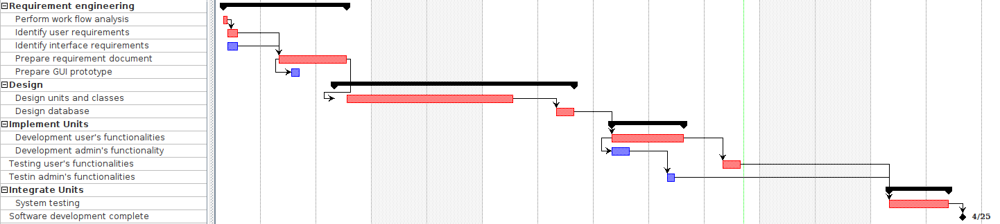

# Project Estimation - CURRENT
Date: 20/04/2023

Version:1

# Estimation approach
<!-- Consider the EZWallet  project in CURRENT version (as received by the teachers), assume that you are going to develop the project INDEPENDENT of the deadlines of the course -->
# Estimate by size
### 
|             | Estimate                        |             
| ----------- | ------------------------------- |  
| NC =  Estimated number of modules to be developed   | 9 |             
|  A = Estimated average size per module, in LOC       | 84  | 
| S = Estimated size of project, in LOC (= NC * A) | 756  |
| E = Estimated effort, in person hours (here use productivity 10 LOC per person hour)  |   75.6  |   
| C = Estimated cost, in euro (here use 1 person hour cost = 30 euro) | 2268 | 
| Estimated calendar time, in calendar weeks (Assume team of 4 people, 8 hours per day, 5 days per week ) | 0.47  |               

# Estimate by product decomposition
### 
|         component name    | Estimated effort (person hours)   |             
| ----------- | ------------------------------- | 
|requirement document    | 7 |
| GUI prototype | 5 |
|design document | 8 |
|code | 30 |
| unit tests | 15 |
| api tests | 20 |
| management documents  | 15 |

# Estimate by activity decomposition
### 
|         Activity name    | Estimated effort (person hours)   |             
| ----------- | ------------------------------- | 
| Perform work flow  analysis | 2 |
| Identify user requirements | 4 |
| Identify interface requirements| 4 |
| Prepare requirements document | 14 |
| Prepare GUI prototype | 4 |
| Design units and classes | 8 |
| Design database | 8 |
| Development user's functionalities | 16 |
| Development admin's functionalities | 8 |
| Testing user's functionalities | 8 |
| Testing admin's functionalities | 4 |
| System test | 12 |
---

# Summary

<!-- Report here the results of the three estimation approaches. The  estimates may differ. Discuss here the possible reasons for the difference -->

|             | Estimated effort                        |   Estimated duration |          
| ----------- | ------------------------------- | ---------------|
| estimate by size |75.6 person hours|0.47 calendar weeks|
| estimate by product decomposition |100 person hours| 0.63 calendar weeks|
| estimate by activity decomposition | 92 person hours| 0.58 calendar weeks|

## Discussion
----
The estimated effort and duration vary depending on the method used, and this is due to the  fact that it's more accurate to estimate these values when more details are available. For example, the estimated effort by size is only based on the LOC number, while the estimatd effort by product decoposition is based on multiple phases such as the code development, api test, and unit tests. 