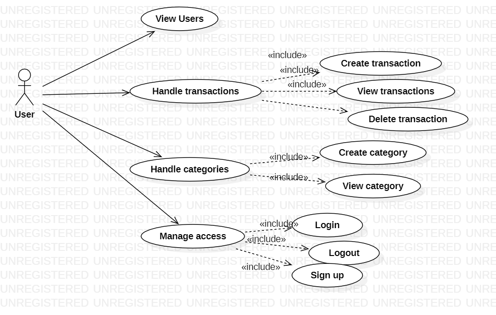
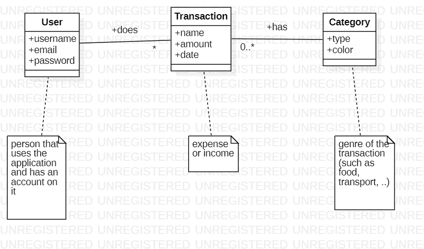
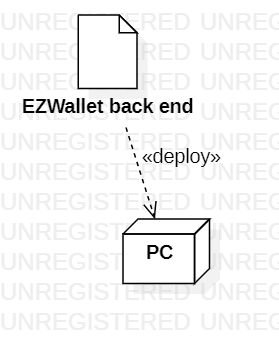

# Requirements Document - current EZWallet

Date: 

Version: V1 - description of EZWallet in CURRENT form 

 

# Contents

- [Informal description](#informal-description)
- [Stakeholders](#stakeholders)
- [Context Diagram and interfaces](#context-diagram-and-interfaces)
	+ [Context Diagram](#context-diagram)
	+ [Interfaces](#interfaces) 
	
- [Stories and personas](#stories-and-personas)
- [Functional and non functional requirements](#functional-and-non-functional-requirements)
	+ [Functional Requirements](#functional-requirements)
	+ [Non functional requirements](#non-functional-requirements)
- [Use case diagram and use cases](#use-case-diagram-and-use-cases)
	+ [Use case diagram](#use-case-diagram)
	+ [Use cases](#use-cases)
    	+ [Relevant scenarios](#relevant-scenarios)
- [Glossary](#glossary)
- [System design](#system-design)
- [Deployment diagram](#deployment-diagram)

# Informal description
EZWallet (read EaSy Wallet) is a software application designed to help individuals and families keep track of their expenses. Users can enter and categorize their expenses, allowing them to quickly see where their money is going. EZWallet is a powerful tool for those looking to take control of their finances and make informed decisions about their spending.

# Defect table

| Defect | Description | 
| ----------------- |:-----------|
| get_users, privacy defect | the function get_users returns all users of the application, without checking if the requester is logged in. Even if logged in, any user would be able to access information about any other user |
| get_labels  | The behavior of function get_labels is unclear. Probably it is meant to return the color associated to the category of a transaction, but it does not do so |
| user is not associated to her transactions | Nowhere in the application a user is linked to the transactions she has created. So each user will see all transactions of all users.  |
| users | Overall, the application seems to be made for one user, although there are functions for user management |

# Stakeholders

| Stakeholder name  | Description | 
| ----------------- |:-----------|
|   User     | User of the application | 
| Developer   | Person who develops and maintains the application |

# Context Diagram and interfaces

## Context Diagram

## Interfaces

| Actor | Logical Interface | Physical Interface  |
| ------------- |:-------------:| :-----:|
|   User     | GUI | PC |

# Stories and personas

Persona 1: 
John, 25 years old, is a computer professional. He decides he wants to know how he is spending his money using a software application.  
Story: 
John makes an expense. As soon as possible he opens the applications and logs the expense, attaching to it a category.  
Story:  
At the end of each month John analyzes the expenses of the month, overall and per category. 

# Functional and non functional requirements

## Functional Requirements

| ID      | Name  | 
| :-------------|:-----|
|  FR1      | Manage account |
|  FR11 | Register |
|  FR12 | login |
|  FR13 | logout |
|  FR2      | Handle transactions |
|  FR21 | create transaction |
|  FR22 | show transactions  |
|  FR23 | delete transaction |
|  FR3      | Handle categories |
|  FR31 | create category |
|  FR32 | show categories  |
|  FR4      | Handle users |
|  FR41 | create user |
|  FR42 | show users  |

## Non Functional Requirements

| ID        | Type (efficiency, reliability, ..)           | Description  | Refers to |
| ------------- |:-------------:| :-----| -----:|
|  NFR1     |Efficiency | All functions of the application should have a response time lower than 0.5 sec.| All FR |
| NFR2 |Usability | At least 95% of average users (no computer professionals with more than 1 year of experience of using PC) can use the application within 1 hour, with no training| All FR| 

# Use case diagram and use cases

## Use case diagram

### Use case 1, Login (UC1)
| Actors Involved        | User |
| ------------- |:-------------:| 
|  Precondition     | User not logged in, user registered |
|  Post condition     | User logged in |
|  Nominal Scenario     | Scenario 1.1 |
|  Variants     | None |
|  Exceptions     | Scenario 1.2, 1.3, 1.4|

##### Scenario 1.1 

| Scenario 1.1 | Login |
| ------------- |:-------------:| 
|  Precondition     | User not logged in, user registered |
|  Post condition     | User logged in |
| Step#        | Description  |
|  1     | System: Ask email, password |  
|  2     | User: Provide email, password. |
|  3     | System: Read email, password. Check cookie,  user is not logged in. |
|  4	 | System: Retrieve password, compare with the one provided. Passwords match, user is auhorized|

##### Scenario 1.2

| Scenario 1.2 | Wrong password |
| ------------- |:-------------:| 
|  Precondition     | User not logged in, user registered |
|  Post condition     | User not logged in |
| Step#        | Description  |
|  1     | System: Ask email password. |  
|  2     | User: Provide email, password. |
|  3     | System: Read email, password. Check cookie,  the user is not logged in. |
|  4	 | System: Given email, find the user. |
|  5	 | System: Retrieve password, compare with the one provided. Passwords do not match, user is not auhorized|

##### Scenario 1.3

| Scenario 1.3 | User not registered |
| ------------- |:-------------:| 
|  Precondition     | User not logged in, user not registered |
|  Post condition     | User not logged in |
| Step#        | Description  |
|  1     | System: Ask email password. |  
|  2     | User: Provide email, password. |
|  3     | System: Read email, password. Check cookie,  the user is not logged in. |
|  4	 | System: Given email, find the user. User is not found. User not authorized|

##### Scenario 1.4

| Scenario 1.4 | User already logged in |
| ------------- |:-------------:| 
|  Precondition     | User logged in, user registered |
|  Post condition     | User logged in |
| Step#        | Description  |
|  1     | System: Ask email password. |  
|  2     | User: Provide email, password. |
|  3     | System: Read email, password. Check cookie,  the user is already logged in. |
|  4	 | System: Return an error message  |

### Use case 2, Logout (UC2)

| Actors Involved        | User |
| ------------- |:-------------:| 
|  Precondition     | User logged in |
|  Post condition     | User not logged in |
|  Nominal Scenario     | Scenario 2.1 |
|  Variants     |  |
|  Exceptions     | Scenario 2.2 |

##### Scenario 2.1 

| Scenario 2.1 | Logout through button |
| ------------- |:-------------:| 
|  Precondition     | User logged in |
|  Post condition     | User not logged in |
| Step#        | Description  |
|  1     | User: Asks to logout |
|  2     | System: Find user, check cookie, the  user is logged in. |
|  3	 | System: remove authorization to the user device  |
|  4	 | System: Show a logout confirmation message. |

##### Scenario 2.2 

| Scenario 2.2 | User already logged out |
| ------------- |:-------------:| 
|  Precondition     | User not logged in |
|  Post condition     | User not logged in |
| Step#        | Description  |
|  1     | User: Go to /logout address. |  
|  2     | System: Check that the user isn't already logged out. |
|  3     | System: User hasn't performed login yet. Show an error message. |

### Use case 3, Registration (UC3)

| Actors Involved        | User |
| ------------- |:-------------:| 
|  Precondition     | The user doesn't have an account |
|  Post condition     | User registered |
|  Nominal Scenario     | Scenario 3.1 |
|  Variants     | None |
|  Exceptions     | Scenario 3.2 |

##### Scenario 3.1 

| Scenario 3.1 | Registration |
| ------------- |:-------------:| 
|  Precondition     | The user doesn't have an account |
|  Post condition     | User registered |
| Step#        | Description  |  
|  1     | User: Ask to register  |
|  2     | System: ask username, email, password |
|  2     | User: Provide username, email, password |
|  3     | System: Read username, email, password. |
|  4     | System: Check that the provided email isn't associated with any account yet. The email hasn't been used yet. |
|  5     | System: Create a new user and store his information  |

##### Scenario 3.2 

| Scenario 3.2 | User already registered |
| ------------- |:-------------:| 
|  Precondition     | The user has an account |
|  Post condition     | Registration failed |
| Step#        | Description  |
|  1     | User: Ask to register  |
|  2     | System: ask username, email, password |
|  2     | User: Provide username, email, password |
|  3     | System: Read username, email, password. |
|  4     | System: Check that the provided email isn't associated with any account yet. The email has been used already. Provide error message|

### Use case 4, Handle transactions (UC4)

| Actors Involved        | User |
| ------------- |:-------------:| 
|  Precondition     | The user is logged in |
|  Post condition     | Transaction inserted/deleted/shown |
|  Nominal Scenario     | Scenario 4.1, 4.2, 4.3 |
|  Variants     |  |
|  Exceptions     |  |

##### Scenario 4.1 

| Scenario 4.1 | Insert transaction |
| ------------- |:-------------:| 
|  Precondition     | The user is logged in |
|  Post condition     | Transaction inserted |
| Step#        | Description  |
|  1     | USer: ask to insert a transaction |
|  2     | System: ask name, amount and type of the transaction |
|  3     | User: Insert  name, amount and type of the transaction. |
|  4     | System: Create a new transaction and store it |

##### Scenario 4.2

| Scenario 4.2 | Get the existing transactions |
| ------------- |:-------------:| 
|  Precondition     | The user is logged in and has associated transactions |
|  Post condition     | Transactions shown |
| Step#        | Description  |
|  1     | User: Ask all transactions |  
|  2     | System: Retrieve all the transactions and show them. |

##### Scenario 4.3

| Scenario 4.3 | Delete a transaction |
| ------------- |:-------------:| 
|  Precondition     | The user is logged in |
|  Post condition     | Transaction deleted |
| Step#        | Description  |
|  1     | User: ask to delete a transaction. |  
|  2     | System: ask for transaction to delete |
|  3     | User: select transaction |
|  4     | System: Retrieve the transaction and delete it. |

### Use case 5, Handle categories (UC5)

| Actors Involved        | User |
| ------------- |:-------------:| 
|  Precondition     | The user is logged in |
|  Post condition     | Category inserted/shown |
|  Nominal Scenario     | Scenario 5.1, 5.2 |
|  Variants     |  |
|  Exceptions     |  |

##### Scenario 5.1 

| Scenario 5.1 | Insert category |
| ------------- |:-------------:| 
|  Precondition     | The user is logged in |
|  Post condition     | Category inserted |
| Step#        | Description  |
|  1	 | User: Ask to insert category  |
|  2     | System: ask category type and color |
|  3     | User: Insert  type and color. |
|  4     | System: Create a new category and store it |

##### Scenario 5.2

| Scenario 5.2 | Get categories |
| ------------- |:-------------:| 
|  Precondition     | The user is logged in |
|  Post condition     | Categories shown |
| Step#        | Description  |
|  1     | User: Ask to show all categories. |  
|  2     | System: Retrieve all the categories and show them. |

### Use case 6, Handle users (UC7)

| Actors Involved        | User |
| ------------- |:-------------:| 
|  Precondition     | None (for 7.1), user logged in (for 7.2) |
|  Post condition     | User(s) shown |
|  Nominal Scenario     | Scenario 7.1, 7.2 |
|  Variants     | None |
|  Exceptions     |  |

##### Scenario 7.1 

| Scenario 7.1 | Get all users |
| ------------- |:-------------:| 
|  Precondition     | None |
|  Post condition     | Users shown |
| Step#        | Description  |
|  1     | User: Ask all users |  
|  2     | System: Retrieve all the users, with their information, and show them. |

##### Scenario 7.2

| Scenario 7.2 | Get user information |
| ------------- |:-------------:| 
|  Precondition     | The user is logged in |
|  Post condition     | User information shown |
| Step#        | Description  |
|  1     | User: ask user info for a certain user. |  
|  2     | System: Retrieve the details about the user that's performing the request. |
|  3     | System: Check if the username provided matches with the user's one. They match. |
|  4     | System: Show user information. |

# Glossary

# System Design

There is only one component in the system. A client would be needed, but it is not available in V1.

# Deployment Diagram 

