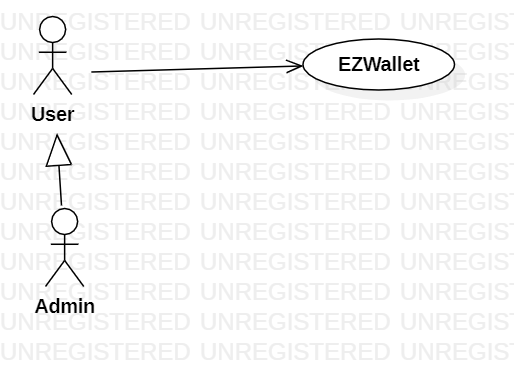
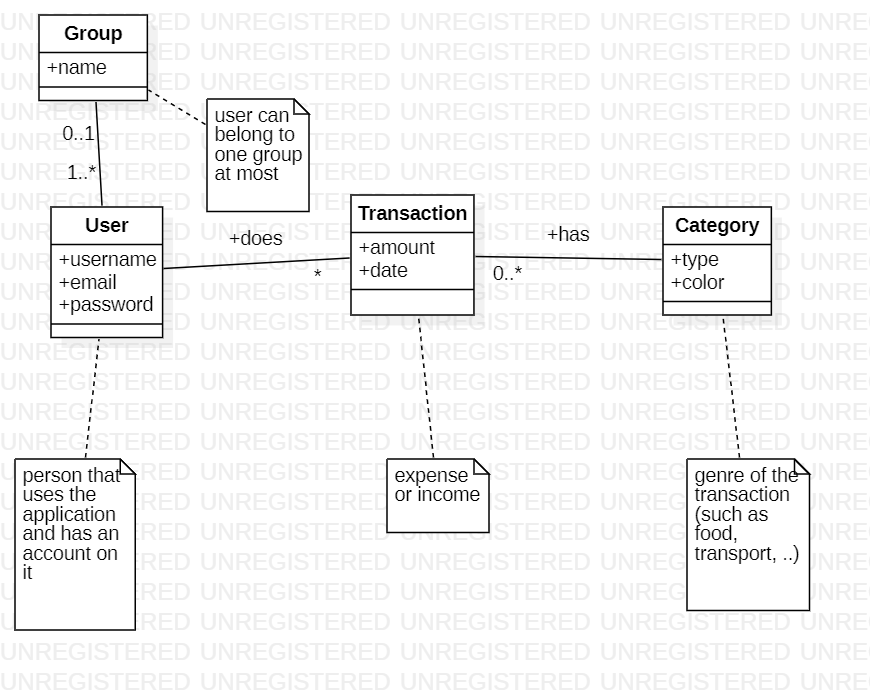

# Requirements Document - future EZWallet

Version: V2 - description of EZWallet in FUTURE form 

 

# Contents

- [Stakeholders](#stakeholders)
- [Context Diagram and interfaces](#context-diagram-and-interfaces)
	+ [Context Diagram](#context-diagram)
	+ [Interfaces](#interfaces) 
- [Functional and non functional requirements](#functional-and-non-functional-requirements)
	+ [Functional Requirements](#functional-requirements)
	+ [Non functional requirements](#non-functional-requirements) 
- [Glossary](#glossary)
- [System design](#system-design)
- [Deployment diagram](#deployment-diagram)

# Stakeholders

| Stakeholder name  | Description | 
| ----------------- |:-----------|
|   User     | User of the application | 
| Developer   | Person who develops and maintains the application |
| Admin | User with higher privileges |

# Context Diagram and interfaces

## Context Diagram

## Interfaces

| Actor | Logical Interface | Physical Interface  |
| ------------- |:-------------:| :-----:|
|   User     | GUI | PC |
|   Admin     | GUI | PC |

# Functional and non functional requirements

## Functional Requirements

| ID        | Name  | Description |
| :------------- |:-------------|:--|
|  FR1    | Manage users | ------------- |
| FR11 | register |  create a new user |
| FR12| login |  authorize access for a given user |
| FR13| logout | stop authorization for a given user|
| FR14 | registerAdmin | create a new Admin |
| FR15 | getUsers | return all users |
| FR16 | getUser | return info about a specific user |
| FR17 | deleteUser | cancel a user |
| FR2 | Manage groups | ------------- |
| FR21 | createGroup | create a new group |
| FR22| getGroups | return all groups |
| FR23| getGroup | return info about a specific group |
| FR24| addToGroup | add many users to a given group |
| FR26| removeFromGroup | remove many users from a given group |
| FR28| deleteGroup | cancel a group, users members of the group remain unchanged |
|  FR3   |  Manage  transactions| -------------|
|FR31| createTransaction| create a new transaction|
|FR32| getAllTransactions | return all transactions (by all users)|
| FR33| getTransactionsByUser  | return transactions of a given user. transactions may be filtered by date, by period, by max / min amount|
| FR34| getTransactionsByUserByCategory| return transactions of a given user and a given category|
| FR35| getTransactionsByGroup | return all transactions of all users of a given group|
| FR36| getTransactionsByGroupByCategory | return all transactions of all users of a given group, filtered by a given category|
| FR37| deleteTransaction | delete a given transaction|
| FR38| deleteTransactions | delete many transactions|
|  FR4  |  Manage categories | -------------|
| FR41| createCategory | create a new category|
| FR42| updateCategory | modify existing category|
| FR43| deleteCategory | delete a given category|
| FR44 | getCategories | list all categories|

## Access rights
| Function        | User  | Admin |
| :------------- |:-------------:|:---:|
| register |X|X|
| login |X|X|
| logout |X|X|
| registerAdmin ||X|
| getUsers ||X|
| getUser |X (only his/her information)|X (any user)|
| deleteUser ||X|
| createGroup | X | X |
| getGroups|  | X |
| getGroup| X (only own group) | X (any group) |
| addToGroup| X (only own group) | X (any group) |
| removeFromGroup|X (only own group) | X (any group) |
| deleteGroup| | X (any group) |
|createTransaction| X| X|
|getAllTransactions|  | X|
| getTransactionsByUser| X (only his/her transactions)  | X (any user's transactions)|
| getTransactionsByUserByCategory|  X (only his/her transactions)  | X (any user's transactions)|
| getTransactionsByGroup|   X (only own group's transactions)  | X (any group's transactions)|
| getTransactionsByGroupByCategory|   X (only own group's transactions)  | X (any group's transactions)|
| deleteTransaction| X | X|
| deleteTransactions|  | X|
| createCategory|  | X|
| updateCategory|  | X|
| deleteCategory|  | X|
| getCategories | X | X|

## Non Functional Requirements

| ID        | Type (efficiency, reliability, ..)           | Description  | Refers to |
| ------------- |:-------------:| :-----| -----:|
|  NFR1     |Efficiency | The application should have a response time lower than 0.5 sec.|FR1,FR2,FR3,FR4,FR5 |
| NFR2 |Usability | At least 95% of average users (no computer professionals with more than 1 year of experience of using PC) can use the application within 1 hour, with no training| FR1,FR2,FR3,FR4,FR5| 

# Glossary

# System Design

There is only one component in the system. A client would be needed, but it is not available in V2.

# Deployment Diagram 

