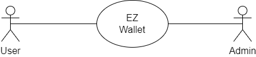
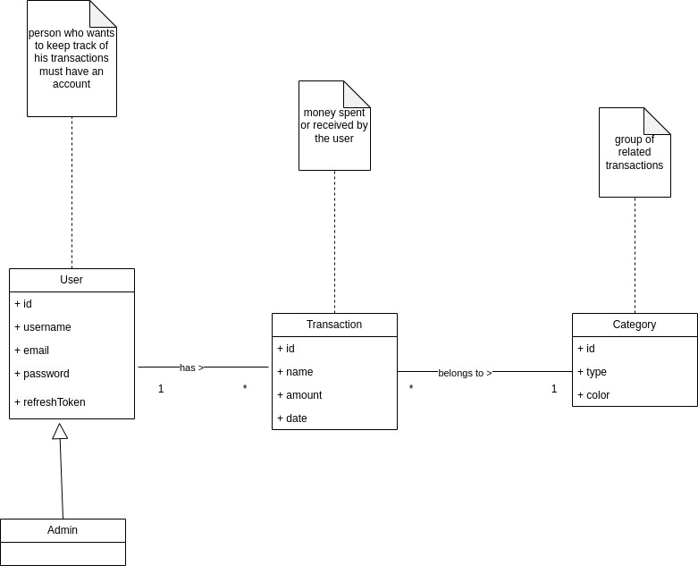

# Requirements Document - current EZWallet

Date: 21/04/2023

Version: V1 - description of EZWallet in CURRENT form (as received by teachers)

 
| Version number | Change |
| ----------------- |:-----------|
|1.0 |Final | 

# Contents

- [Requirements Document - current EZWallet](#requirements-document---current-ezwallet)
- [Contents](#contents)
- [Informal description](#informal-description)
- [Stakeholders](#stakeholders)
- [Context Diagram and interfaces](#context-diagram-and-interfaces)
	- [Context Diagram](#context-diagram)
	- [Interfaces](#interfaces)
- [Stories and personas](#stories-and-personas)
- [Functional and non functional requirements](#functional-and-non-functional-requirements)
	- [Functional Requirements](#functional-requirements)
	- [Non Functional Requirements](#non-functional-requirements)
- [Use case diagram and use cases](#use-case-diagram-and-use-cases)
	- [Use case diagram](#use-case-diagram)
		- [Use case 1, REGISTER](#use-case-1-register)
		- [Use case 2, LOGIN](#use-case-2-login)
		- [Use case 3, LOGOUT](#use-case-3-logout)
		- [Use case 4, READ USERS](#use-case-4-read-users)
		- [Use case 5, CREATE TRANSACTION](#use-case-5-create-transaction)
		- [Use case 6, DELETE TRANSACTION](#use-case-6-delete-transaction)
		- [Use case 7, READ TRANSACTIONS](#use-case-7-read-transactions)
		- [Use case 8, CREATE CATEGORY](#use-case-8-create-category)
- [Glossary](#glossary)
- [System Design](#system-design)
- [Deployment Diagram](#deployment-diagram)

# Informal description
EZWallet (read EaSy Wallet) is a software application designed to help individuals and families keep track of their expenses. Users can enter and categorize their expenses, allowing them to quickly see where their money is going. EZWallet is a powerful tool for those looking to take control of their finances and make informed decisions about their spending.

# Stakeholders

| Stakeholder name  | Description 											 | 
| ----------------- |:------------------------------------------------------:|
| Users				| individuals that want to keep track of their expenses  | 
| Admin   			| monitors user accounts | 

# Context Diagram and interfaces

## Context Diagram

## Interfaces

| Actor | Logical Interface | Physical Interface  |
| ------------- |:-------------:| -----:|
|   User     | GUI (to be defined – key functions, add, view and delete transactions/categories) | Smartphone or PC (web browser) |
|   Admin    | GUI (to be defined – key functions, same as normal users + the ability to monitor user accounts) | Smartphone or PC (web browser) |

# Stories and personas

* Persona 1: low income student, male, single, 21 years old
	* story: would like to keep track of how much he is spending to stay within budget

* Persona 2: high income professional, female, engaged, 30 years old
	* story: trying to keep track of her investments 

* Persona 3: average income professional, male, married, 45 years old 
	* story: wants his children to use a budget tracking application, so they can 
	learn how to manage their money

* Persona 4: low income professional, female, single, 28 years old 
	* story: wants to save money, so she would like to know where she is overspending or making unneccessary payments

* Persona 5: average income freelancer, male, single, 32 years old
	* story: wants to keep track of all transactions related to his small bussiness 

# Functional and non functional requirements

## Functional Requirements

| ID        | Description  |
| :------------- |:-------------| 
| FR1     |  Authorize and authenticate |
| FR1.1     |  Login as an old user |
| FR1.2     |  Log out |
| FR1.3| Register as a new user|
| FR1.4 | Get user details |
| FR2 | Manage transactions |
| FR2.1 | Create a transaction and specify its category |
| FR2.2 | Delete a transaction |
| FR2.3 | View transactions and their categories |
| FR3 | Create category |
| FR4 | Manage users |
| FR4.1 | Get users by username |

## Non Functional Requirements

| ID        | Type (efficiency, reliability, ..)           | Description  | Refers to |
| ------------- |:-------------:| :-----:| -----:|
|  NFR1     |  Usability | Users should use the core functions after following a simple tutorial on first login | all FR|
|  NFR2     | Compatibility | The website (frontend) should run on all browsers | all FR|
|  NFR3 | Efficiency | website load time should be less than 3s from PC and 5s for mobile, server response time should be less than 0.5s | all FR| 
|  NFR4 | Maintainability | fix defects in less than 1hr, add/modify/or cancel a software function within 24hrs | all FR| 

# Use case diagram and use cases

## Use case diagram

### Use case 1, REGISTER
| Actors Involved        | User |
| ------------- |:-------------:| 
|  Precondition     | User has no account |
|  Post condition     | User has a new account |
|  Nominal Scenario     | User uses a new email |
|  Variants     | --- |
|  Exceptions     |  User uses an email that is linked to an account |

| Scenario 1.1 | Nominal |
| ------------- |:-------------:| 
|  Precondition     | User has no account |
|  Post condition     | User has a new account |
| Step#        | Description  |
|  1     | User asks to sign up |  
|  2     | System asks for email and password |
|  3     | User inserts required fields |
|  4     | User submits form |
|  5     | System verifies that the email is not in use|
|  6   | System stores the account |

| Scenario 1.2 | Exception |
| ------------- |:-------------:| 
|  Precondition     | User has an account |
|  Post condition     | The operation ends with an error message |
| Step#        | Description  |
|  1     | User asks to sign up |  
|  2     | System asks for email and password |
|  3     | User inserts required fields |
|  4     | User submits form |
|  5     | System verifies that the User account already exists |
|  6     | System notifies the User that he/she is already registered |

### Use case 2, LOGIN
| Actors Involved        | User |
| ------------- |:-------------:| 
|  Precondition     | User has an account |
|  Post condition     | User is authorized |
|  Nominal Scenario     | User uses correct email and password  |
|  Variants     | --- |
|  Exceptions     | User enters email and password that do not match or the User enters an email that is not registered |
<!-- |  Exceptions     | The email and password do not match or email does not exist or a server error occurs | -->

| Scenario 2.1 | Nominal|
| ------------- |:-------------:| 
|  Precondition     | User has an account |
|  Post condition     | User is authorized |
| Step#        | Description  |
|  1     | User asks to login |  
|  2     | System asks for email and password |
|  3     | User enters required fields|
|  4     | System verifies that email and password are correct|
|  5     | User is authorized |

| Scenario 2.2 | Exception |
| ------------- |:-------------:| 
|  Precondition     | User has an account |
|  Post condition     | The operation ends with an error message |
| Step#        | Description  |
|  1     | User asks to login |  
|  2     | System asks email and password |
|  3     | User enters required fields |
|  4     | System verifies that email and password do not match|
| 5   | the user is not authorized |
|6| System notifies the User that he/she used wrong credentials|

| Scenario 2.3 | Exception |
| ------------- |:-------------:| 
|  Precondition     | User does not have an account |
|  Post condition     | The operation ends with an error message |
| Step#        | Description  |
|  1     | User asks to login |  
|  2     | System asks email and password |
|  3     | User enters email and password |
|  4     | System verifies that the email is not registered|
| 5   | the user is not authorized |
|6| System notifies the User that he/she needs to register first|

### Use case 3, LOGOUT
| Actors Involved        | User |
| ------------- |:-------------:| 
|  Precondition     | User is logged in |
|  Post condition     | User is logged out |
|  Nominal Scenario     | User is logged in |
|  Variants     | --- |
|  Exceptions     | User does not have an account |

| Scenario 3.1 | Nominal |
| ------------- |:-------------:| 
|  Precondition     | User has an account |
|  Post condition     | User is logged out |
| Step#        | Description  |
|  1     | User asks to logout |  
|  2     | System allows the operation |

| Scenario 3.2| Exception |
| ------------- |:-------------:| 
|  Precondition     | User does not have an account |
|  Post condition     | User receives an error message |
| Step#        | Description  |
|  1     | User asks to logout |  
|  2     | System denies the operation because the user account was not found |
|  3     | Error message is sent to the user |

### Use case 4, READ USERS
| Actors Involved        | Admin |
| ------------- |:-------------:| 
|  Precondition     | Admin is logged in |
|  Post condition     | Users details are shown |
|  Nominal Scenario     | Admin is logged in|
|  Variants     | --- |
|  Exceptions     | --- |

| Scenario 4.1 | Nominal |
| ------------- |:-------------:| 
|  Precondition     | Admin is logged in |
|  Post condition     | All Users details are shown |
| Step#        | Description  |
|  1     | The admin asks for reading users details |  
|  2     | System shows required information |

### Use case 5, CREATE TRANSACTION
| Actors Involved        | User |
| ------------- |:-------------:| 
|  Precondition     | User is logged in |
|  Post condition     | Transaction is created |
|  Nominal Scenario     | User is logged in |
|  Variants     | --- |
|  Exceptions     | --- |

| Scenario 5.1 | Nominal |
| ------------- |:-------------:| 
|  Precondition     | User is logged in |
|  Post condition     | A transaction is created |
| Step#        | Description  |
|  1     | User asks to create a transaction|  
|  2     | System asks to specify name, amount and type of transaction|  
|  3     | User specifies the required fields |
|  4    | User submits					|
|5 | System sets the date to current date|
|  6     | System creates the transaction |

### Use case 6, DELETE TRANSACTION

| Actors Involved        | User |
| ------------- |:-------------:| 
|  Precondition     | User is logged in |
|  Post condition     | A transaction is deleted |
|  Nominal Scenario     | User is logged in|
|  Variants     | --- |
|  Exceptions     | --- |

| Scenario 6.1 | Nominal |
| ------------- |:-------------:| 
|  Precondition     | User is logged in |
|  Post condition     | A transaction is deleted |
| Step#        | Description  |
|  1     | User asks to delete a transaction|  
|  2     | System deletes the transaction|

### Use case 7, READ TRANSACTIONS

| Actors Involved        | User |
| ------------- |:-------------:| 
|  Precondition     | User is logged in |
|  Post condition     | User receives a list of all of his transactions |
|  Nominal Scenario     | User has at least one transaction |
|  Variants     | the user has no transactions |
|  Exceptions     | --- |

| Scenario 7.1 | Nominal |
| ------------- |:-------------:| 
|  Precondition     | User is logged in and he/she has at least one transaction |
|  Post condition     | User receives a list of all of his/her transactions |
| Step#        | Description  |
|  1     | User asks to view his/her transactions |  
|  2     | System looks up all transactions and the catogries they belong to |
|  3     | System returns a list of transactions and their categories to the user |

| Scenario 7.2 | Variant |
| ------------- |:-------------:| 
|  Precondition     | User is logged in and he/she doesn't have any transactions |
|  Post condition     | User receives an empty list |
| Step#        | Description  |
|  1     | User asks to view his/her transactions |  
|  2     | System looks up all transactions and the catogries they belong to |
|  3     | System doesn't find any transactions |
|  4     | System returns an empty list |

### Use case 8, CREATE CATEGORY
| Actors Involved        | User |
| ------------- |:-------------:| 
|  Precondition     | User is logged in |
|  Post condition     | Category is created |
|  Nominal Scenario     | User is logged in |
|  Variants     | --- |
|  Exceptions     | --- |

| Scenario 8.1 | Nominal |
| ------------- |:-------------:| 
|  Precondition     | User is logged in |
|  Post condition     | Category is created |
| Step#        | Description  |
|  1	| User asks to create a new category |
|  2     | System asks for type and color of category|  
|  3     | User specifies required fields |
|  4     | User submits					|
|  5     | System creates the category |

# Glossary

# System Design

# Deployment Diagram 

---
---
---
# Table of defects
| Function in which we have a defect |Defect description | How we dealt with it  |
| ------------- |:-------------:|:---------:|
|getUsers | A code should be implemented to detect if the user is an admin or not | in the requirements document we considered that this code was implemented |
| get_labels  |There's a mistake in the code: we should have category_type = v.categories_info.type instead of v.type and color: v.categories_info.color instead of v.color  |We assumed that the code was correctly implemented for its purpose|