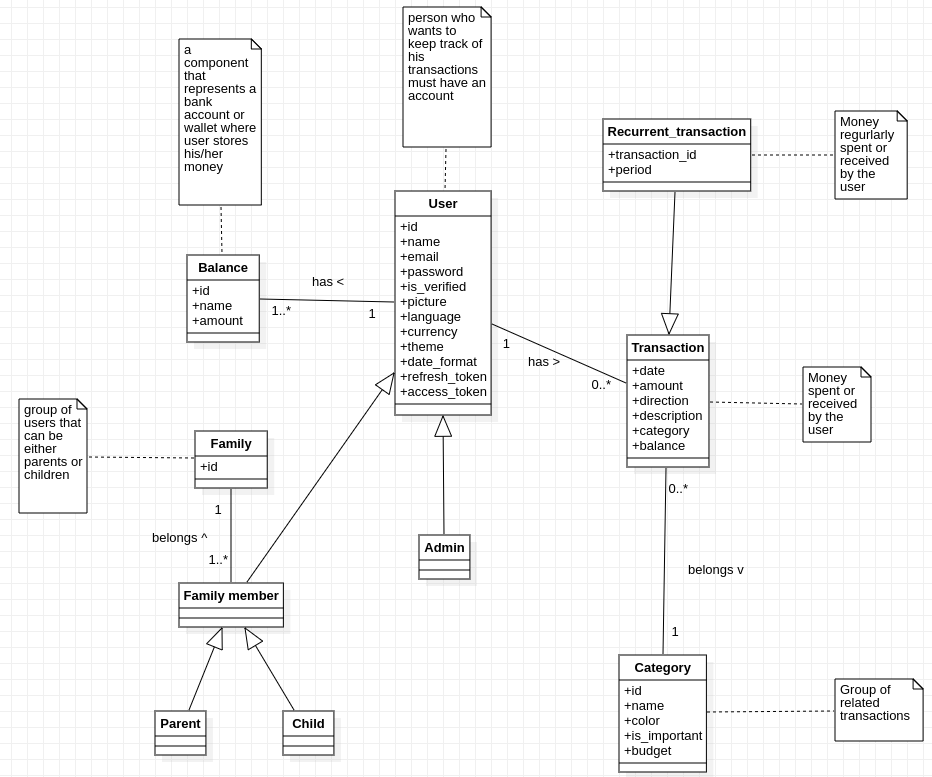

# Requirements Document - future EZWallet

Date: 28/04/2023

Version: V2 - description of EZWallet in FUTURE form (as proposed by the team)

 
| Version number | Change |
| ----------------- |:-----------|
| 1.0 | Final | 

# Contents

- [Informal description](#informal-description)
- [Stakeholders](#stakeholders)
- [Context Diagram and interfaces](#context-diagram-and-interfaces)
	+ [Context Diagram](#context-diagram)
	+ [Interfaces](#interfaces) 
	
- [Stories and personas](#stories-and-personas)
- [Functional and non functional requirements](#functional-and-non-functional-requirements)
	+ [Functional Requirements](#functional-requirements)
	+ [Non functional requirements](#non-functional-requirements)
- [Use case diagram and use cases](#use-case-diagram-and-use-cases)
	+ [Use case diagram](#use-case-diagram)
	+ [Use cases](#use-cases)
    	+ [Relevant scenarios](#relevant-scenarios)
- [Glossary](#glossary)
- [System design](#system-design)
- [Deployment diagram](#deployment-diagram)

# Informal description
EZWallet is a website designed to help individuals and families keep track of their transactions. It allows users to add transactions, categorize them, and set a budget for each category by using the envelope budgetting method. Users can gain more financial awareness by examining the application's detailed summaries and trends. It is also a powerful tool for parents to monitor their children's finances. It allows  parents to add their children into a common family account, set their allowance, and keep an eye on their spendings.

main features: 

* Budget management using the envelope budgeting method
* Family accounts creation and management
* Detailed reports of user's spending and income activities
* Automatic conversion to a user defined currency

## Business Model
the application is free to use, but software companey makes money by selling advertising space on the application.

# Stakeholders

| Stakeholder name  | Description | 
| ----------------- |:-----------:|
|     User   |        Individual who wants to keep track of their expenses or their family expenses| 
| Admin| Manages users' accounts|
|Currency exchange service| API for converting transaction's currency to the specified default currency|
|Google ads| Third party service for providing ads|
|Start up company| Company that develops the software and provides the service|
|Competitors| Companies that provide the same service|
|Third party authentication service(Google authenticator and Apple authenticator)| Third party service for providing authentication|

# Context Diagram and interfaces

## Context Diagram

## Interfaces

| Actor | Logical Interface | Physical Interface  |
| ------------- |:-------------:| -----:|
|   User    |GUI(to be defined -Manage transactions, budget categories, view reports, etc...)  | Smartphone or PC (Web browser) |
| Admin | GUI(to be defined - same functionalities as user + Manage users' accounts) | Smartphone or PC (Web browser)|
|Google ads| Internet link | Google ads' API|
|Currency exchange service| Internet link| Currency exchange service's API|
|Third party authentication service| Internet link| Apple authentication's API and Google authentication's API|

# Stories and personas
- Persona 1: 20 years old male student who goes out a lot
  - wants to keep track of his monthly expenses and identify problem areas in his spendings and fix them by changing his financial habbits. 
- Persona 2: 50 years old Business man who travels a lot
  - wants to keep track of his expenses in different countries without  having to exchange currencies each time he adds a new transaction to his account.
- Persona 3: 38 years old single mother of 2 boys
  -  wants to keep track of her kids' expenses and teach them to be responsible.
- Persona 4: Parents of a 10 years old kid who is spending a lot of money on toys
  - his parents want to monitor his purshases and limit them.
- Persona 5: 30 years old man, with average income
  - would like to keep historical reports of his spendings and monitor trends to limit his expenses in some unecessary categories and keep an organized view of his financial state.
- Persona 6: 25 years old newly employed male 
  - would like to budget his salary so that he avoids debt and save money to buy a car.

# Functional and non functional requirements

## Functional Requirements

| ID        | Description  |
| ------------- |:-------------:| 
| FR1     | Authorize and authenticate 		|
|FR1.1|  Log in|
| FR1.1.1  | Log in using email and password |
| FR1.1.2   |	Log in using 3rd party agent    |
| FR1.2   | Reset password                  |
| FR1.3   | Register as a new user          |
| FR1.4   | Register as a new user using 3rd party service | 
| FR1.5   | Verify email                    |
| FR1.6   | Log out                         |
| FR2     | Manage personal account				    |
| FR2.1   | Delete personal account					|
| FR2.2  | Edit profile picture            |
| FR2.3   | Change password 				|
| FR2.4   | Edit personal information 				|
|FR2.5| Change application's settings|
| FR2.5.1   | Change language   |
| FR2.5.2  | Change display currency | 
| FR2.5.3  | Change date format              | 
| FR3 | Manage categories           | 
| FR3.1 | Create a category             | 
| FR3.2 | Delete a category             | 
| FR3.3| View categories|
| FR3.4 | Edit a category           | 
| FR3.4.1 | Edit name          | 
| FR3.4.2 | Edit color         | 
|FR3.5| Label important category|
|FR3.6| Unlabel a category |
|FR3.7  |  Allocate budget for a category |
|FR3.8  |  Transfer budget from one category to another category | 
|  FR4     |  Manage transaction  | 
|  FR4.1     |  Add a new transaction | 
|  FR4.2     |  Edit a transaction| 
|  FR4.3     |  Delete a transaction |
|FR4.4| View transactions|
|  FR4.4.1     |  Filter transactions|
|  FR4.4.1.1    |  Filter by date|
|  FR4.4.1.2   |  Filter by category|
|  FR4.4.1.3    |  Filter by amount spent|
|  FR4.4.2    |  Sort transactions|
|  FR4.4.2.1    |  Sort by date|
|  FR4.4.2.2    |  Sort by amount spent|
|  FR4.4.3    |  Group transactions|
|  FR4.4.3.1    |  Filter by date|
|  FR4.4.3.2   |  Filter by category|
|  FR5     | Manage balances |    
|  FR5.1     |  Add a new balance |        
|  FR5.2     |  Delete a balance |  
|  FR5.3     |  View balances|        
|FR6| Join family account| 
|FR7| Create a family account|
|FR8| Manage family accounts|
|FR8.1| Delete a family account|
|FR8.2| Invite users to a family account|
|FR8.3| Add income to a child's account| 
|FR8.4| leave family account | 
|FR8.5| remove user from family account | 
|FR8.6| View child's dashboard |
|FR9| View reports |
|FR9.1| View summary|
|FR9.1.1| View overall income|
|FR9.1.2|View overall expenses|
|FR9.1.3| View overall budget for each category|
|FR9.1.4|View percentage of spendings by category in a specific time range|
|FR9.1.5|View percentage of amount spent from the available budget for each category|
|FR9.1.6|View overall expenses per category|
|F9.2|View Balance trend|
|FR9.2.1|View total amount of all balances|
|FR9.2.2|View amount of selected balances|
|FR9.3| View Expense's trend|
|FR9.3.1|View expenses|
|FR9.3.2|View expenses per category|
|FR9.4|View income trend|
| FR10         | Manage users' accounts |
| FR10.1      | View list of users |
|FR10.2| View a user's account|
| FR10.3       | Update a user's account |
| FR10.4       | Delete a user's account |
| FR11| Manage ads|
| FR12| Manage currency exchange for transactions in different currencies|

# Table of rights 

| FR       | User  | Admin | Google ads|Currency exchange service|Third party authentication service
| ------------- |:-------------:|:-------------:|:-------------:|:-------------:|:-------------:| 
|FR1.1.1| yes| yes| no| no| no| 
|FR1.1.2| yes| yes| no| no| yes|
|FR1.2|yes| yes| no| no| no| 
|FR1.3|yes|yes| no| no|no|
|FR1.4|yes|yes|no|no| yes|
|FR1.5|yes|yes| no| no|no|
|FR1.6|yes|yes| no| no|no|
|FR2.1|yes|yes| no| no|no|
|FR2.2|yes|yes| no| no|no|
|FR2.3|yes|yes| no| no|no|
|FR2.4|yes|yes| no| no|no|
|FR2.5.1|yes|yes| no| no|no|
|FR2.5.2|yes|yes| no| yes|no|
|FR2.5.3|yes|yes| no| no|no|
|FR3|yes|yes| no| no|no|
|FR4|yes|yes| no| no|no|
|FR5|yes|yes| no| no|no|
|FR6|yes|yes| no| no|no|
|FR7|yes|yes| no| no|no|
|FR8|yes|yes| no| no|no|
|FR9|yes|yes| no| no|no|
|FR10|no|yes|no|no|no|
|FR11|no|no|yes|no|no|
|FR12|no|no|no|no|yes|

## Non Functional Requirements

| ID        | Type (efficiency, reliability, ..)           | Description  | Refers to |
| ------------- |:-------------:| :-----:| -----:|
|  NFR1     |  Usability | Users should use the core functions after following a simple tutorial sent by mail when signing up | all FR|
|  NFR2     | Compatibility | The website (frontend) should run on all browsers | all FR|
|  NFR3     | Security | Protection from malicious access, user authorization, comply with data safety and privacy laws such as GDPR | all FR|
|  NFR4 | Efficiency | website load time should be less than 0.5s from PC and 0.3s for mobile, server response time should be less than 0.5s | FR4, FR3, FR2, FR5| 
|  NFR5 | Efficiency | website load time should be less than 1.2s from PC and 1s for mobile, server response time should be less than 0.7s | FR2, FR6, FR7, FR8, FR10 | 
|  NFR6 | Efficiency | website load time should be less than 1.6s from PC and 1.4s for mobile, server response time should be less than 1s | FR1, FR9 | 
|  NFR7 | Maintainability | fix defects in less than 1hr, add/modify/or cancel a software function within 24hrs | all FR| 
|  NFR8 | Availability | The server should not go down for more than 30 mins at a time | all FR| 
| NFR9| Responsiveness| Website page can adapt on the device's screen where it is shown| All FR|
| NFR10| Scalability| The website should accomodate to the increase in the number of users | All FR|

# Use case diagram and use cases

## Use case diagram

### Use case 1, SIGN UP

| Actors Involved | User |
| ------------- |:-------------:| 
|  Precondition     | User has no account 		|
|  Post condition   | User has a new account and a tutorial video is sent by email	|
|  Nominal Scenario | User uses a new email and a valid password with correct confirmation |
|  Variants     	| --- |
|  Exceptions     	| User uses an email that is already linked to an account or he/she has entered a non-compliant password or confirmation password does not match|

| Scenario 1.1 | Nominal |
| ------------- |:-------------:| 
|  Precondition     | User has no account 	 |
|  Post condition   | User has a new account and a tutorial video is sent by email	 |
| Step#  | Description  |
|  1     | User asks to sign up 									  |  
|  2     | System asks for email and password 						  |
|  3     | User inserts the email and a valid password according to system's rules | 
|  4     | User write the password again in the confirmation field	  |
|  5     | User submits form 										  |
|  6     | System verifies that the email is not in use 			  |
|  7     | System verifies that password complies with the rules and that confirmation password is equal|
|  8     | System creates the account 								  |
|  9     | System adds a default category "Others" to the account and sets its budget to 0    |
|  10    | System adds a default balance "Default" to the account     |
|  11    | System redirects user to the home page 					  |

| Scenario 1.2 | Exception |
| ------------- |:-------------:| 
|  Precondition     | User has an account 					   |
|  Post condition   | The operation ends with an error message |
| Step#  | Description  |
|  1     | User asks to sign up 									  |  
|  2     | System asks for email and password 						  |
|  3     | User inserts required fields 							  |
|  4     | User submits form 										  |
|  5     | System verifies that the user's account already exists 	  |
|  6     | System notifies the User that he/she is already registered |

| Scenario 1.3 | Exception |
| ------------- |:-------------:| 
|  Precondition     | User has no account and password is not compliant with rules |
|  Post condition   | The operation ends with an error message |
| Step#  | Description  |
|  1     | User asks to sign up 									  |  
|  2     | System asks for email and password 						  |
|  3     | User inserts email and password							  |
|  4     | User writes the password again in the confirmation field	  |
|  5     | User submits form 										  |
|  6     | System verifies that the email is not in use 			  |
|  7     | System verifies that the password does not complies with the rules|
|  8     | System notifies the user that he/she has entered a non-compliant password |

| Scenario 1.4 | Exception |
| ------------- |:-------------:| 
|  Precondition     | User has no account and confirmation password does not match |
|  Post condition   | The operation ends with an error message |
| Step#  | Description  |
|  1     | User asks to sign up 									  |  
|  2     | System asks for email and password 						  |
|  3     | User inserts email and a valid password according to system's rules							  |
|  4     | User write the password again in the confirmation field	  |
|  5     | User submits form 										  |
|  6     | System verifies that the email is not in use 			  |
|  7     | System verifies that the password complies with the rules and that confirmation password is not equal|
|  8     | System notifies the user that passwords do not match |

### Use case 2, SIGN UP WITH 3rd PARTY AGENT
| Actors Involved | User |
| ------------- |:-------------:| 
|  Precondition     | User has no account 		|
|  Post condition   | User has a new account and a tutorial video is sent by email		|
|  Nominal Scenario | User sign up using a 3rd party service |
|  Variants     	| --- |
|  Exceptions     	| User is not registered to any 3rd party agent, user fails to autheniticate using the 3rd party service|

| Scenario 2.1 | Nominal |
| ------------- |:-------------:| 
|  Precondition       | User has an account |
|  Post condition     | User has a new account and a tutorial video is sent by email	|
| Step#  | Description  |
|  1     | User asks to login using a 3rd party service 				  |  
|  2     | System asks for the service to be used 						  |
|  3     | User chooses the service 									  |
|  4     | System redirect the user to the 3rd party service login form   |
|  5     | 3rd party authentication service asks the user to login		  |
|  6     | user provides all the necessary information to login 		  |
|  7     | 3rd party authentication service authorizes the user			  | 
|  8     | System checks if the user is authorized with 3rd party service |
|  9     | System creates the account 								  |
|  10    | System adds a default category "Others" to the account and sets its budget to 0    |
|  11    | System adds a default balance "Default" to the account     |
|  12    | System redirects user to the home page 					  |

| Scenario 2.2 | Exception |
| ------------- |:-------------:| 
|  Precondition       | User has an account 	|
|  Post condition     | User is not authorized  |
| Step#  | Description  |
|  1     | User asks to login using a 3rd party service 				  |  
|  2     | System asks for the service to be used 						  |
|  3     | User chooses the service 									  |
|  4     | System redirect the user to the 3rd party service login form   |
|  5     | 3rd party authentication service asks the user to login		  |
|  6     | user provides all the necessary information to login 		  |
|  7     | 3rd party authentication service authorizes the user			  | 
|  8     | System checks if the user is authorized with 3rd party service |
|  9     | System finds out that the user is not registerd using the 3rd party authenitcation service |
|  10    | System informs the user that the account does no exist |

| Scenario 2.3 | Exception |
| ------------- |:-------------:| 
|  Precondition       | User has an account 	|
|  Post condition     | User is not authorized  |
| Step#  | Description  |
|  1     | User asks to login using a 3rd party service 				  |  
|  2     | System asks for the service to be used 						  |
|  3     | User chooses the service 									  |
|  4     | System redirect the user to the 3rd party service login form   |
|  5     | 3rd party authentication service asks the user to login		  |
|  6     | user provides all the necessary information to login 		  |
|  7     | 3rd party authentication service does not authorizes the user  | 
|  8     | System notifies the user that authentication phase has failed  |

### Use case 3, LOGIN
| Actors Involved        | User |
| ------------- |:-------------:| 
|  Precondition    	  | User has an account 				 |
|  Post condition     | User is authorized 					 |
|  Nominal Scenario   | User uses correct email and password |
|  Variants     	  | --- |
|  Exceptions     	  | Email and password do not match or the user enters an email that is not registered |

| Scenario 3.1 | Nominal |
| ------------- |:-------------:| 
|  Precondition     | User has an account |
|  Post condition   | User is authorized  |
| Step#  | Description  |
|  1     | User asks to login 								  |  
|  2     | System asks for email and password 				  |
|  3     | User enters email and password 				      |
|  4     | System verifies that email and password are correct|
|  5     | User is authorized 								  |

| Scenario 3.2 | Exception |
| ------------- |:-------------:| 
|  Precondition     | User has an account 	 |
|  Post condition   | User is not authorized |
| Step#  | Description  |
|  1     | User asks to login 				  						   |  
|  2     | System asks for email and password 						   |
|  3     | User enters email and password          					   |
|  4     | System verifies that email and password do not match		   |
|  5   	 | User is not authorized									   |
|  6     | System notifies the user that he/she used wrong credentials |

| Scenario 3.3 | Exception |
| ------------- |:-------------:| 
|  Precondition     | User does not have an account |
|  Post condition   | User is not authorized 		|
| Step#  | Description  |
|  1     | User asks to login 								|  
|  2     | System asks for email and password 				|
|  3     | User enters email and password 					|
|  4     | System verifies that the email is not registered |
|  5   	 | User is not authorized 							|

### Use case 4, LOGIN USING 3rd PARTY AGENT
| Actors Involved        | User, 3rd party authentication service |
| ------------- |:-------------:| 
|  Precondition    	  | User has an account with 3rd party agent |
|  Post condition     | User is authorized 						 |
|  Nominal Scenario   | User log in using a 3rd party service 	 |
|  Variants     	  | --- |
|  Exceptions     	  | User is not registered to any 3rd party agent, User fails to autheniticate using the 3rd party service |

| Scenario 4.1 | Nominal |
| ------------- |:-------------:| 
|  Precondition       | User has an account |
|  Post condition     | User is authorized |
| Step#  | Description  |
|  1     | User asks to login using a 3rd party service 				  |  
|  2     | System asks for the service to be used 						  |
|  3     | User chooses the service 									  |
|  4     | System redirect the user to the 3rd party service login form   |
|  5     | 3rd party authentication service asks the user to login		  |
|  6     | user provides all the necessary information to login 		  |
|  7     | 3rd party authentication service authorizes the user			  | 
|  8     | System checks if the user is authorized with 3rd party service |
|  9    | User is authorized 											  |

| Scenario 4.2 | Exception |
| ------------- |:-------------:| 
|  Precondition       | User has an account 	|
|  Post condition     | User is not authorized  |
| Step#  | Description  |
|  1     | User asks to login using a 3rd party service 				  |  
|  2     | System asks for the service to be used 						  |
|  3     | User chooses the service 									  |
|  4     | System redirect the user to the 3rd party service login form   |
|  5     | 3rd party authentication service asks the user to login		  |
|  6     | user provides all the necessary information to login 		  |
|  7     | 3rd party authentication service authorizes the user			  | 
|  8     | System checks if the user is authorized with 3rd party service |
|  9    | System finds out that the user is not registerd using the 3rd party authenitcation service |
|  10   | System informs the user that the account does no exist |

| Scenario 4.3 | Exception |
| ------------- |:-------------:| 
|  Precondition       | User has an account 	|
|  Post condition     | User is not authorized  |
| Step#  | Description  |
|  1     | User asks to login using a 3rd party service 				  |  
|  2     | System asks for the service to be used 						  |
|  3     | User chooses the service 									  |
|  4     | System redirect the user to the 3rd party service login form   |
|  5     | 3rd party authentication service asks the user to login		  |
|  6     | user provides all the necessary information to login 		  |
|  7     | 3rd party authentication service does not authorizes the user			  | 
|  8     | user is not authorized |

### Use case 5, RESET PASSWORD WHEN FORGOTTEN
| Actors Involved        | User |
| ------------- |:-------------:| 
|  Precondition    	  | User is not logged in 	 |
|  Post condition     | User resets his/her password |
|  Nominal Scenario   | user changes to a new password within the allowed time 	 |
|  Variants     	  | |
|  Exceptions     	  | email expired, user uses the current password as a new password or email is not verified yet|

| Scenario 5.1 | Nominal |
| ------------- |:-------------:| 
|  Precondition       | User is not logged in 	 |
|  Post condition     | User resets his/her password |
| Step#  | Description  |
|  1     | User asks to reset his/her password						|  
|  2     | User inserts his email 									|
|  3     | System sends an email to user for resetting the password |
|  4     | User confirms the request and changes his/her password	|
|  5     | System updates the user's password 						|

| Scenario 5.2 | Exception |
| ------------- |:-------------:| 
|  Precondition       | User is not logged in |
|  Post condition     | User does not reset his/her password |
| Step#  | Description  |
|  1     | User asks to reset his/her password 						|	 
|  2     | User inserts his email 									| 
|  3     | System sends an email to user for resetting the password |
|  4     | User confirms the request but received email is expired	|
|  5     | System does not reset password and shows an error message 							|

| Scenario 5.3 | Exception |
| ------------- |:-------------:| 
|  Precondition       | User is not logged in |
|  Post condition     | User does not reset his/her password |
| Step#  | Description  |
|  1     | User asks to reset his/her password 						|	   
|  2     | User inserts his email 									| 
|  3     | System sends an email to user for resetting the password |
|  4     | User confirms the request but the user uses the current password as a new password	|
|  5     | System does not reset password and shows an error message 							|

| Scenario 5.4 | Exception |
| ------------- |:-------------:| 
|  Precondition       | User is not logged in |
|  Post condition     | User does not reset his/her password |
| Step#  | Description  |
|  1     | User asks to reset his/her password 						|	  
|  2     | User inserts his email 									|  
|  3     | System does not send an email to user for resetting the password because it is not verified|
|  4     | System does not reset password and shows an error message 							|

### Use case 6, VERIFY EMAIL
| Actors Involved        | User |
| ------------- |:-------------:| 
|  Precondition    	  | User is logged in 					 |
|  Post condition     | User verifies his/her email 			 |
|  Nominal Scenario   | user verifies his/her email within the allowed time limit					 |
|  Variants     	  | |
|  Exceptions     	  | email expired |

| Scenario 6.1 | Nominal |
| ------------- |:-------------:| 
|  Precondition       | User is logged in		|
|  Post condition     | User verifies his/her email |
| Step#  | Description  |
|  1     | User asks for verifying his/her email					 |  
|  2     | System sends an email to the user for verifying the email |
|  3     | User confirms the request 								 |
|  4     | System updates the user's data 							 |

| Scenario 6.2 | Exception |
| ------------- |:-------------:| 
|  Precondition       | User is logged in 			   |
|  Post condition     | User does not verify his/her email |
| Step#  | Description  |
|  1     | User asks for verifying his/her email 					 |  
|  2     | System sends an email to the user for verifying the email |
|  3     | User confirms the request but received email is expired	 |
|  4     | System shows an error message 							 |

### Use case 7, LOGOUT
| Actors Involved        | User |
| ------------- |:-------------:| 
|  Precondition       | User is logged in  |
|  Post condition     | User is logged out |
|  Nominal Scenario   | User is logged in  |
|  Variants       | --- |
|  Exceptions     | User does not have an account |

| Scenario 7.1 | Nominal |
| ------------- |:-------------:| 
|  Precondition     | User has an account |
|  Post condition   | User is logged out  |
| Step#        | Description  |
|  1     | User asks to logout |  
|  2     | System allows the operation |

| Scenario 7.2| Exception |
| ------------- |:-------------:| 
|  Precondition     | User does not have an account	|
|  Post condition   | User receives an error message|
| Step#        | Description  |
|  1     | User asks to logout 												  |  
|  2     | System denies the operation because the user account was not found |
|  3     | Error message is sent to the user 								  |

### Use Case 8, MANAGE PERSONAL ACCOUNT

#### Use case 8.1, DELETE PERSONAL ACCOUNT
| Actors Involved        | User |
| ------------- |:-------------:| 
|  Precondition    	  | User is logged in				|
|  Post condition     | User has no account anymore |
|  Nominal Scenario   | User confirmed operation by providing his/her password				|
|  Variants     	  | --- |
|  Exceptions     	  | User does not delete his/her account because he/she used wrong credentials |

| Scenario 8.1.1 | Nominal |
| ------------- |:-------------:| 
|  Precondition       | User is logged in				|
|  Post condition     | User has not an account anymore |
| Step#  | Description  |
|  1     | User asks to delete his/her account 	|  
|  2     | System requests for the password 	|
|  3     | User enters his/her password 			|
|  4     | System checks the password			|
|  5     | System deletes user's account 		|

| Scenario 8.1.2 | Exception |
| ------------- |:-------------:| 
|  Precondition       | User is logged in	 		|
|  Post condition     | User still have his/her account |
| Step#  | Description  |
|  1     | User asks to delete his/her account			   |  
|  2     | System requests for the password 			   |
|  3     | User enters his/her password 					   |
|  4     | System checks the password and it does not match|
|  5    | System shows an error message 				   |

#### Use case 8.2, EDIT PERSONAL INFORMATION
| Actors Involved        | User |
| ------------- |:-------------:| 
|  Precondition    	  | User is logged in		  	  |
|  Post condition     | User updates his/her information |
|  Nominal Scenario   | User is logged in			  |
|  Variants     	  | --- |
|  Exceptions     	  | --- |

| Scenario 8.2.1 | Nominal |
| ------------- |:-------------:| 
|  Precondition       | User is logged in |
|  Post condition     | User updates his/her information |
| Step#  | Description  |
|  1     | User asks to modify his/her account's information			|  
|  2     | System shows pre-compiled and editable form of current personal information to the user  	|
|  3     | User modifies his/her information							|
|  4     | System updates user's information							|

#### Use case 8.3, EDIT PROFILE PICTURE
| Actors Involved        | User |
| ------------- |:-------------:| 
|  Precondition    	  | User is logged in 				 |
|  Post condition     | User updates his/her profile picture |
|  Nominal Scenario   | User is logged in				 |
|  Variants     	  | --- |
|  Exceptions     	  | --- |

| Scenario 8.3.1 | Nominal |
| ------------- |:-------------:| 
|  Precondition       | User is logged in 				 |
|  Post condition     | User updates his/her profile picture |
| Step#  | Description  |
|  1     | User asks to modifies his/her account's profile picture	|  
|  2     | System requests the new profile picture 					|
|  3     | User uploads the image 									|
|  4     | System updates user's profile picture 

#### Use case 8.4, CHANGE PASSWORD
| Actors Involved        | User |
| ------------- |:-------------:| 
|  Precondition    	  | User is logged in 					|
|  Post condition     | User changes his/her password 			|
|  Nominal Scenario   | User is logged in				    |
|  Variants     	  | --- |
|  Exceptions     	  | user provides an incorrect current password, user uses the same password					|

| Scenario 8.4.1 | Nominal |
| ------------- |:-------------:| 
|  Precondition       | User is logged in 		  |
|  Post condition     | User changes his/her password |
| Step#  | Description  |
|  1     | User asks to change his/her password 					|  
|  2     | System aks for current and new password  |
|  3     | User provides all the required information	|
|  4     | System updates the user's password 						|

| Scenario 8.4.2 | Exception |
| ------------- |:-------------:| 
|  Precondition       | User is logged in 				  |
|  Post condition     | User does not change his/her password |
| Step#  | Description  |
|  1     | User asks to change his/her password 					|  
|  2     | System aks for current and new password  |
|  3     | User provides inputs an incorrect current password	|
|  4     | System does not update the password and informs user that password is incorrect 						|

| Scenario 8.4.3 | Exception |
| ------------- |:-------------:| 
|  Precondition       | User is logged in 				  |
|  Post condition     | User does not change his/her password |
| Step#  | Description  |
|  1     | User asks to change his/her password 					|  
|  2     | System aks for current and new password  |
|  3     | User provides all the required information, but uses the current password as a new password	|
|  4     | System does not update the password and informs user that password is incorrect 						|
					|
### Use Case 8.5, CHANGE APPLICATION'S SETTINGS
#### Use case 8.5.1, CHANGE DEFAULT DISPLAY CURRENCY
| Actors Involved        | User, Currency exchange service |
| ------------- |:-------------:| 
|  Precondition    	  | User is logged in				|
|  Post condition     | User changes default diplay currency	|
|  Nominal Scenario   | User is logged in				|
|  Variants     	  | --- |
|  Exceptions     	  | --- |

| Scenario 8.5.1.1 | Nominal |
| ------------- |:-------------:| 
|  Precondition       | User is logged in 				|
|  Post condition     | User changes default display currency	|
| Step#  | Description  |
|  1     | User asks for changing default display currency																 |  
|  2     | System shows list of possible choices 																 |
|  3     | User chooses a new currency 																		 |
|  4     | System updates each amount of money with the new currency through a 3rd party currency exchange service |

#### Use case 8.5.2, CHANGE DATE FORMAT
| Actors Involved        | User |
| ------------- |:-------------:| 
|  Precondition    	  | User is logged in 					  |
|  Post condition     | User changes date format 			  |
|  Nominal Scenario   | User is logged in					  |
|  Variants     	  | --- |
|  Exceptions     	  | --- |

| Scenario 8.5.2.1 | Nominal |
| ------------- |:-------------:| 
|  Precondition       | User is logged in 		 |
|  Post condition     | User changes date format |
| Step#  | Description  |
|  1     | User asks to change date format for the whole application	|  
|  2     | System questions the user for the new format 				|
|  3     | User enters the new format 									|
|  4     | System updates date format in application's settings |

#### Use case 8.5.3, CHANGE LANGUAGE
| Actors Involved        | User |
| ------------- |:-------------:| 
|  Precondition    	  | User is logged in		|
|  Post condition     | User changes language	|
|  Nominal Scenario   | User is logged in		|
|  Variants     	  | --- |
|  Exceptions     	  | --- |

| Scenario 8.5.3.1 | Nominal |
| ------------- |:-------------:| 
|  Precondition       | User is logged in 		|
|  Post condition     | User changes language	|
| Step#  | Description  |
|  1     | User asks to change language					|  
|  2     | System shows the list of possible languages	|
|  3     | User selects a new language 				|
|  4     | System updates application's language 		|

### Use Case 9, MANAGE CATEGORIES

#### Use Case 9.1: CREATE A CATEGORY

| Actors Involved        | User |
| ------------- |:-------------:| 
|  Precondition     | User is logged in |
|  Post condition     | A new category is created |
|  Nominal Scenario     | User is logged in and Category name he/she specifies is not in use |
|  Variants     | --- |
|  Exceptions     |  User specifies a category name that is already in use |

| Scenario 9.1.1 | Nominal |
| ------------- |:-------------:| 
|  Precondition     | User is logged in |
|  Post condition     | User has a new account |
| Step#        | Description  |
|  1     | User asks to create a new category |  
|  2     | System asks to specify category name and choose color from list of available colors |
|  3     | User inserts required fields |
|  4     | User submits form |
|  5     | System verifies that the chosen name is not in use|
|  6     | system sets the budget for the category to 0 |
|  7   | System stores new category |

| Scenario 9.1.2 | Exception |
| ------------- |:-------------:| 
|  Precondition     | User is logged in but specifies a categoty name that is already in use |
|  Post condition     | Operation ends with an error message |
| Step#        | Description |
|  1     | User asks to create a new category |  
|  2     | System asks to specify category name and choose color from list of available colors |
|  3     | User inserts required fields |
|  4     | User submits form |
|  5     | System verifies that the chosen name is in use|
|  6   | System notifies the user that he/she has to choose another name for the category |

#### Use Case 9.2: DELETE A CATEGORY

| Actors Involved        | User |
| ------------- |:-------------:| 
|  Precondition     | User is logged in |
|  Post condition     | A category is deleted |
|  Nominal Scenario     | User asks to delete a non-default category and confirms the operation |
|  Variants     | --- |
|  Exceptions     | User tries to delete the default "Others" category, User does not confirm the operation  |

| Scenario 9.2.1 | Nominal |
| ------------- |:-------------:| 
|  Precondition     | User is logged in |
|  Post condition     | A category is deleted and all its corresponding transactions become associated to the default category (others...) |
| Step#        | Description  |
|  1     | User asks to delete a category |  
|  2     | System asks the user to confirm the operation  |
|  3     | User confirms the operation |
|  4     | System deletes the category |
|  5     | System fetches all transactions related to this category and associates them to the default category "Others"|
 

| Scenario 9.2.2 | Exception |
| ------------- |:-------------:| 
|  Precondition     | User is logged in |
|  Post condition     | No changes made |
| Step#        | Description  |
|  1     | User asks to delete a category |  
|  2     | System asks the user to confirm the operation  |
|  3     | User does not confirm the operation | 
|  4     | System does not delete the category | 

| Scenario 9.2.3 | Exception |
| ------------- |:-------------:| 
|  Precondition     | User is logged in |
|  Post condition     | No changes made and the user receives an error message |
| Step#        | Description  |
|  1     | User asks to delete the "Others" default category |  
|  2     | System rejects the request and shows an error message  |

#### Use Case 9.3: VIEW CATEGORIES

| Actors Involved        | User |
| ------------- |:-------------:| 
|  Precondition     | User is logged in |
|  Post condition     | User receives a list of all available categories |
|  Nominal Scenario     | User is logged in |
|  Variants     | --- |
|  Exceptions     | --- |

| Scenario 9.3.1 | Nominal |
| ------------- |:-------------:| 
|  Precondition     | User is logged in and he/she has at least one category |
|  Post condition     | User receives a list of all of his/her categories |
| Step#        | Description  |
|  1     | User asks to view his/her categories |  
|  2     | System looks up all categories|
|  3     | System returns a list of categories |

#### Use Case 9.4: EDIT A CATEGORY

| Actors Involved        | User |
| ------------- |:-------------:| 
|  Precondition     | User is logged in |
|  Post condition     | A category is updated |
|  Nominal Scenario     | User is logged in and has a category to be edited  |
|  Variants     | ---|
|  Exceptions     | User tries to update the default "Others" category, User changes name to a name already associated to another category |

| Scenario 9.4.1 | Nominal |
| ------------- |:-------------:| 
|  Precondition     | User is logged in and does not change the name of a non-default category to name already in use |
|  Post condition     | A category is updated |
| Step#        | Description  |
|  1     | User asks to edit a specific category |  
|  2     | System asks user to change name or/and color||
|  3     | User applies changes |
|  4     | System verifies that the new name is not in use|
|  5     | System applies changes|

| Scenario 9.4.2 | Exception |
| ------------- |:-------------:| 
|  Precondition     | User is logged in and he/she changes the category name to a name already in use|
|  Post condition     | Operation ends with an error message |
| Step#        | Description  |
|  1     | User asks to edit a non-default category |  
|  2     | System ask user to change name or/and color|
|  3     | User apply changes |
|  4     | System verifies that chosen name is in use|
|  5   | System notifies the user that he/she has to choose another name for the category |

| Scenario 9.4.3 | Exception |
| ------------- |:-------------:| 
|  Precondition     | User is logged in and he/she changes the category name to a name already in use|
|  Post condition     | Operation ends with an error message |
| Step#        | Description  |
|  1     | User asks to edit a default category |  
|  2     | System rejects the request and returns an error message |

#### Use Case 9.5: LABEL IMPORTANT CATEGORIES

| Actors Involved        | User |
| ------------- |:-------------:| 
|  Precondition     | User is logged in  |
|  Post condition     | A category is labeled as important |
|  Nominal Scenario     | User is logged in and the category is not already labeled|
|  Variants     | ---|
|  Exceptions     | Category is already labeled as important |

| Scenario 9.5.1 | Nominal |
| ------------- |:-------------:| 
|  Precondition     | User is logged in and the category is not already labeled |
|  Post condition     | A category is labeled as important |
| Step#        | Description  |
|  1     | User asks to label a specific category |  
|  2     | System verifies that the category is not labeled|
|  3     | System labels the category as important|

| Scenario 9.5.2 | Exception |
| ------------- |:-------------:| 
|  Precondition     | User is logged in and the category is already labeled |
|  Post condition     | Operation ends with an error message |
| Step#        | Description  |
|  1     | User asks to label a specific category |  
|  2     | System verifies that the category is already labeled|
|  3    | System notifies the user that the category is already labeled|

#### Use Case 9.6: UNLABEL A CATEGORY

| Actors Involved        | User |
| ------------- |:-------------:| 
|  Precondition     | User is logged in |
|  Post condition     | A categoty is unlabeled|
|  Nominal Scenario     | User is logged in and asks to unlabel a category that has a label|
|  Variants     | ---|
|  Exceptions     |User is logged in and asks to unlabel a category that has no label|

| Scenario 9.6.1 | Nominal |
| ------------- |:-------------:| 
|  Precondition     | User is logged in and asks to unlabel a category that has a label|
|  Post condition     | A category is unlabeled |
| Step#        | Description  |
|  1     | User asks to unlabel a category|  
|  2     | System verifies that the category is labeled|
|  3     | System unlabels the category|

| Scenario 9.6.2 | Exception |
| ------------- |:-------------:| 
|  Precondition     | User is logged in and asks to unlabel a category that has no label|
|  Post condition     | Operation ends with an error message |
| Step#        | Description  |
|  1     | User asks to unlabel a category|  
|  2     | System verifies that the category is already unlabeled|
|  3     | System denies the operation and notifies the user that the category does not have a label |

#### Use case 9.7, ALLOCATE A BUDGET FOR A CATEGORY

| Actors Involved | User  |
| ------------- |:-------------:| 
|  Precondition     | User is logged in |
|  Post condition     | Provided amount of money is added to the specified category's budget |
|  Nominal Scenario     | --- |
|  Variants     | --- |
|  Exceptions     | --- |

| Scenario 9.7.1 | Nominal |
| ------------- |:-------------:| 
|  Precondition     |  User is logged in |
|  Post condition     | Provided amount of money is added to the specified category's budget |
| Step#        | Description  |
|  1     | user asks to set a budget for a category |  
|  2     | system asks the user to select a category and input the amount|
|  3     | user provides all the required information |  
|  4     | system adds the provided amount to the existing budget of the selected category  |
|  5     | system returns a message indicating that the operation was successful |  

#### Use case 9.8, TRANSFER BUDGET FROM ONE CATEGORY TO ANOTHER

| Actors Involved | User  |
| ------------- |:-------------:| 
|  Precondition     | User is logged in |
|  Post condition     | Provided amount of money is moved from the budget of one category to another |
|  Nominal Scenario     | User is logged in |
|  Variants     | --- |
|  Exceptions     | --- |

| Scenario 9.1.1 | Nominal |
| ------------- |:-------------:| 
|  Precondition     |  User is logged in |
|  Post condition     | Provided amount of money is moved from the budget of one category to another  |
| Step#        | Description  |
|  1     | user asks to transfer budget |  
|  2     | system asks the user to select amount, source category, and destination category|
|  3     | user provides all the required information |  
|  4     | system adds the provided amount to the destination category's budget and subtracts it from the source directory's budget  |
|  5     | system notifies the user if the budget for the source directory is now negative |
|  6     | system returns a message indicating that the operation was successful |  

### Use case 10, MANAGE TRANSACTIONS

#### Use case 10.1, ADD A NEW TRANSACTION

| Actors Involved | User, Currency exchange service  |
| ------------- |:-------------:| 
|  Precondition     | User is logged in |
|  Post condition     | A new transaction is added to the user's list of transactions |
|  Nominal Scenario     | The information entered by user is valid and transaction's currency is same as user's display currency |
|  Variants     | User asks to create a recurrent transaction, User didn't specify a category, User added transaction in currency different than display currency | 
|  Exceptions     | User provided invalid information |

| Scenario 10.1.1 | Nominal |
| ------------- |:-------------:| 
|  Precondition     |  User is logged in  |
|  Post condition     | A new transaction is added to the user's list of transactions |
| Step#        | Description  |
|  1     | user asks to add a new transaction |  
|  2     | system asks the user to provide transaction date, amount, direction, currency,  category, balance, an optional description, wether to make it a recurrent transaction, and the period in days of the recurrent transaction  |
|  3     | user fills all required fields and does not select the recurrent transaction option |
|  4	 | user submits form		|
|  5     | system validates all input fields					|
|  6     | system creates transaction |
|  7     | system calculates the remaining budget for the selected category |
|  8     | system notifies the user if the budget for that category was exceeded and also notifies parents if the user is a child in a family |
|  9     | system returns the new transaction and a message indicating that the operation was successful					|

| Scenario 10.1.2 | Variant |
| ------------- |:-------------:| 
|  Precondition     |  User is logged in  |
|  Post condition     | A new recurrent transaction is added to the user's list of transactions after a specific period of time |
| Step#        | Description  |
|  1     | user asks to add a new transaction |  
|  2     | system asks the user to provide transaction date, amount, direction, currency, category, balance, an optional description, wether to make it a recurrent transaction, and the period of the recurrent transaction  |
|  3     | user fills all required fields, selects the recurrent transaction option, and sets the period to the desired amount of days  |
|  4	 | user submits form		|
|  5     | system validates all input fields					|
|  6     | system verifies that transaction's currency is same as display currency|
|  7     | system creates transaction |
|  8     | system calculates the remaining budget for the selected category |
|  9     | system notifies the user if the budget for that category was exceeded and also notifies parents if the user is a child in a family |
|  10     | system returns the new transaction and a message indicating that the operation was successful					|
| 11     | system adds the same transaction to the user's transaction list each time the specified number of days passes |

| Scenario 10.1.3 | Variant |
| ------------- |:-------------:| 
|  Precondition     |  User is logged in  |
|  Post condition     | A new transaction is added to the user's list of transactions |
| Step#        | Description  |
|  1     | user asks to add a new transaction |  
|  2     | system asks the user to provide transaction date, amount, direction, currency, category, balance, an optional description, wether to make it a recurrent transaction, and the period of the recurrent transaction  |
|  3     | user fills all required fields but doesn't select a category |
|  4	 | user submits the form		|
|  5     | system validates all input fields and finds out that the category is not specified |
|  6     | system sets the category to the "Others" default catgeory  |
|  7     | system verifies that transaction's currency is same as display currency| 
|  8     | system calculates the remaining budget for the "Others" category |
|  9     | system notifies the user if the budget for that category was exceeded and also notifies parents if the user is a child in a family |
|  10     | system returns the new transaction and a message indicating that the operation was successful					|

| Scenario 10.1.4 | Variant |
| ------------- |:-------------:| 
|  Precondition     |  User is logged in  |
|  Post condition     | A new transaction is added to the user's list of transactions |
| Step#        | Description  |
|  1     | user asks to add a new transaction |  
|  2     | system asks the user to provide transaction date, amount, direction, currency, category, balance, an optional description, wether to make it a recurrent transaction, and the period of the recurrent transaction  |
|  3     | user fills all required fields but doesn't select a category |
|  4	 | user submits the form		|
|  5     | system validates all input fields|
|  6     | system verifies that transaction's currency is different than display currency| 
|  7     | currency exchange is done through a currency exchange service|
|  8     | system creates transaction |
|  9     | system calculates the remaining budget for the selected category |
|  10     | system returns the new transaction and a message indicating that the operation was successful					|

| Scenario 10.1.5 | Exception |
| ------------- |:-------------:| 
|  Precondition     |  User is logged in  |
|  Post condition     | transaction is not created and the user receives an error message |
| Step#        | Description  |
|  1     | user asks to add a new transaction |  
|  2     | system asks the user to provide transaction date, amount, direction, category, balance, an optional description, wether to make it a recurrent transaction, and the period of the recurrent transaction  |
|  3     | user fills all the required fields |
|  4	 | user submits the form		|
|  5     | system validates all the input fields					|
|  6     | system finds out that one of the field is invalid (ex: user selected a non existing category, an invalid date, or one of the required fields is missing ) |
|  7     | system does not create the transaction					|
|  8     | system return an error message to the User |

#### Use case 10.2, EDIT A TRANSACTION

| Actors Involved | User |
| ------------- |:-------------:| 
|  Precondition     | User is logged in and at least has one transaction |
|  Post condition     | The selected transaction is updated |
|  Nominal Scenario     | The new information entered by user is valid |
|  Variants     | User didn't update information |
|  Exceptions     | User provided invalid information |

| Scenario 10.2.1 | Nominal |
| ------------- |:-------------:| 
|  Precondition     |  User is logged in and has at least one transaction |
|  Post condition     | The selected transaction is updated |
| Step#        | Description  |
|  1     | user asks to edit a transaction |  
|  2     | system displays the transaction and asks the user to update the desired fields (date, amount, direction, category, balance, and description) |
|  3     | user updates the desired fields and submits form |
|  4     | system validates all input fields |
|  5     | system updates the transaction |
|  6     | system returns the updated transaction and a message indicating that the operation was successful					|

| Scenario 10.2.2 | Variant |
| ------------- |:-------------:| 
|  Precondition     |  User is logged in and has at least one transaction |
|  Post condition     | The selected transaction is not updated and the user receives an new error message |
| Step#        | Description  |
|  1     | user asks to edit a transaction |  
|  2     | system displays the transaction and asks the user to update the desired fields (date, amount, direction, category, balance, and description) |
|  3     | user submits form without updating any of the fields |
|  4     | system does not update the transaction |

| Scenario 10.2.3 | Exception |
| ------------- |:-------------:| 
|  Precondition     |  User is logged in and has at least one transaction |
|  Post condition     | The selected transaction is not updated and the user receives an new error message |
| Step#        | Description  |
|  1     | user asks to edit a transaction |  
|  2     | system displays the transaction and asks the user to update the desired fields (date, amount, direction, category, balance, and description) |
|  3     | user updates the desired fields and submits form |
|  4     | system validates all input fields |
|  5     | system finds out that one of the field is invalid (ex: selected a non existing category, an invalid date, or one of the required fields is missing ) |
|  6     | system does not update the transaction and returns an error message	|

#### Use case 10.3, DELETE A TRANSACTION

| Actors Involved | User  |
| ------------- |:-------------:| 
|  Precondition     | User is logged in and has at least one transaction |
|  Post condition     | The selected transactions are deleted |
|  Nominal Scenario     | user confirms the deletion |
|  Variants     | --- |
|  Exceptions     | user does not confirm the operation|

| Scenario 10.3.1 | Nominal |
| ------------- |:-------------:| 
|  Precondition     |  User is logged in and has at least one transaction |
|  Post condition     | The selected transactions are deleted |
| Step#        | Description  |
|  1     | user selects one or more transactions |  
|  2     | user asks to delete transactions |
|  3     | system asks the user to confirm the operation |
|  4     | user confirms his/her intent to delete the selected transactions |
|  5     | system deletes the transactions |
|  6     | system informs the user that the operation was successful |

| Scenario 10.3.2 | Exception |
| ------------- |:-------------:| 
|  Precondition     |  User is logged in and has at least one transaction |
|  Post condition     | The selected transactions are not deleted |
| Step#        | Description  |
|  1     | user selects one or more transactions |  
|  2     | user asks to delete transactions |
|  3     | system asks the user to confirm the operation |
|  4     | user does not confirm his/her intent to delete the selected transactions |
|  5     | The system does not delete the selected transactions |

#### Use case 10.4, VIEW TRANSACTIONS

| Actors Involved | User  |
| ------------- |:-------------:| 
|  Precondition     | User is logged in |
|  Poscondition     | user views a list of his/her transactions |
|  Nominal Scenario     | user has at least one transaction and views all of his/her transactions in the default order  |
|  Variants     | user views a modified list of his/her transactions based on the selected filters, order, and grouping options / user has no transactions  |
|  Exceptions     | --- |

| Scenario 10.4.1 | Nominal |
| ------------- |:-------------:| 
|  Precondition     |  User is logged in and at least has one transaction |
|  Post condition     | user views all of his/her transactions in the default order |
| Step#        | Description  |
|  1     | user asks to view his/her transactions |  
| 2		 | system retrieves all transactions and orders them starting from the most recent transaction |
|  3     | systems returns the retrieved list of transactions |

| Scenario 10.4.2 | Variant |
| ------------- |:-------------:| 
|  Precondition     |  User is logged in and has at least one transaction |
|  Post condition     | user views a modified list of transactions based on the selected filter, order, and grouping options  |
| Step#        | Description  |
|  1     | user asks to view his/her transactions |  
|  2     | system returns a list of all of his/her transactions ordered by starting from the most recent  transaction |
|  3 	|  user asks to change transactions order, group by category or time, or to filter by date, type, amount spent, or category |
| 4		| system retrieves a new list of transactions based on the selected filters, order, and grouping		|
| 5     | system returns the new list of transactions |

| Scenario 10.4.3 | Variant |
| ------------- |:-------------:| 
|  Precondition     |  User is logged in and has no transactions  |
|  Post condition     | user recieves a message indicating that he/she doesn't have any transactions  |
| Step#        | Description  |
|  1     | user asks to view his/her transactions |  
|  2     | system does not find any transactions to show |
|  3 	|  system displays a message indicating that the user didn't add any transactions along with a button to add transactions |
### User Case 11, MANAGE BALANCE
#### Use case 11.1, ADD A NEW BALANCE

| Actors Involved | User  |
| ------------- |:-------------:| 
|  Precondition     | User is logged in |
|  Post condition     | A new balance is added to the User's profile |
|  Nominal Scenario     | user provides valid information |
|  Variants     | user does not specify a starting amount |
|  Exceptions     | user specifies an already in use balance name |

| Scenario 11.1.1 | Nominal |
| ------------- |:-------------:| 
|  Precondition     |  User is logged in |
|  Post condition     | A new balance is added to the User's profile  |
| Step#        | Description  |
|  1     | user asks to add a new balance |  
|  2     | system asks for the balance name, and starting amount |
|  3	 | user provides all the reqiured information |
|  4	 | system validates all input fields (checks that the balance name is not already in use and if the starting balance is set) |  
|  5 | system creates the new balance |
| 6  | system displays list of balances and returns a message indicating that the operation was successful |

| Scenario 11.1.2 | Variant |
| ------------- |:-------------:| 
|  Precondition     |  User is logged in |
|  Post condition     | A new balance is added to the User's profile |
| Step#        | Description  |
|  1     | user asks to add a new balance |  
|  2     | system asks for the balance name, and starting amount |
|  3	 | user provides all the reqiured information but does not set a starting balance |
|  4	 | system validates all input fields (checks that the balance name is not already in use and if the starting balance is set) |  
| 5 | system sets the starting balance to zero | 
|  6 | system creates the new balance |
| 7 | system displays list of balances and returns a message indicating that the operation was successful |

| Scenario 11.1.3 | Exception |
| ------------- |:-------------:| 
|  Precondition     |  User is logged in |
|  Post condition     | The new balance is not created and the user recevies an error message  |
| Step#        | Description  |
|  1     | user asks to add a new balance |  
|  2     | system asks for the balance name, and starting amount |
|  3	 | user provides all the reqiured information but does not set a starting balance |
|  4	 | system validates the input fields (checks that the balance name is not already in use and if the starting balance is set) |  
| 5 | system finds out that the balance name is already in use | 
|  6 | system does not create the new balance |
| 7 | system returns an error message indicating that the operation failed |

#### Use case 11.2, DELETE A BALANCE

| Actors Involved | User  |
| ------------- |:-------------:| 
|  Precondition     | User is logged in |
|  Post condition     | The selected balance is deleted and the user receives a message indicating that the operation was successful |
|  Nominal Scenario     | User has two or more balances |
|  Variants     | --- |
|  Exceptions     | User has only one balance / Child tries to delete allowance balance |

| Scenario 11.2.1 | Nominal |
| ------------- |:-------------:| 
|  Precondition     |  User is logged in and has at least two balances |
|  Post condition     | The selected balance is deleted and the user receives a message indicating that the operation was successful |
| Step#        | Description  |
|  1     | user asks to delete a balance |  
|  2     | system asks the user to confirm the operation and informs the user that existing transactions will still belong to this balance |
|  3     | user confirms his/her intent to delete balance |  
|  4     | system deletes balance |
|  5     | system returns a message indicating that the operation was successful |  

| Scenario 11.2.2 | Exception |
| ------------- |:-------------:| 
|  Precondition     |  User is logged in and has only one balance |
|  Post condition     | The selected balance is not deleted and the user receives the option to create a new balance |
| Step#        | Description  |
|  1     | user asks to delete a balance |  
|  2     | system refuses to delete balance | 
|  3     | system informs the user that he/she should at least have on balance and gives the user the option to create a new balance |

| Scenario 11.2.3 | Exception |
| ------------- |:-------------:| 
|  Precondition     |  User is logged in and has only one balance |
|  Post condition     | The selected balance is not deleted and the user receives the option to create a new balance |
| Step#        | Description  |
|  1     | kid asks to delete allowance balance |  
|  2     | system refuses to delete balance | 
|  3     | system informs the kid that he/she cannot delete the default allowance balance |
#### Use case 11.3, VIEW BALANCES

| Actors Involved | User  |
| ------------- |:-------------:| 
|  Precondition     | User is logged in |
|  Poscondition     | User views a list of his/her balances |
|  Nominal Scenario     | User is logged in  |
|  Variants     | ---  |
|  Exceptions     | --- |

| Scenario 11.3.1 | Nominal |
| ------------- |:-------------:| 
|  Precondition     |  User is logged in |
|  Post condition     | User views all of his/her balances |
| Step#        | Description  |
|  1     | User asks to view his/her balances |  
|  2  | System retrieves all balances |
|  3     | Systems returns the retrieved list of balances |

### Use Case 12, CREATE A FAMILY ACCOUNT

| Actors Involved        | User |
| ------------- |:-------------:| 
|  Precondition     | User is logged in  |
|  Post condition     | A family account is created and the user becomes a parent in it |
|  Nominal Scenario     | User is logged in and does not belong to a family account|
|  Variants     | ---|
|  Exceptions     | User already belonging to a family account |

| Scenario 12.1 | Nominal |
| ------------- |:-------------:| 
|  Precondition     | User is logged in and does not belong to a family account |
|  Post condition     | A family account is created for this user |
| Step#        | Description  |
|  1     | User asks to create a family account |  
|  2     | System verifies that user does not belong to a family account|
|  3     | System create a family account|
|  4     | System adds the user as a parent of this account|

| Scenario 12.2 | Exception |
| ------------- |:-------------:| 
|  Precondition     | User already belongs to a family account|
|  Post condition     | Operation ends with an error message |
| Step#        | Description  |
|  1     | User asks to create a family account |  
|  2     | System verifies that the user already belongs to a family account|
|  3     | System notifies the user that he/she can't create a family account unless he/she exits the current family account he/she belongs to|

### Use Case 13, JOIN A FAMILY ACCOUNT

| Actors Involved        | User |
| ------------- |:-------------:| 
|  Precondition     | User is logged in and received an invitation to a family account |
|  Post condition     | User joins a family account |
|  Nominal Scenario     | User does not already belong to a family account and he/she is invited to be parent of a family account, User does not belong to a family account and he's invited to be a child in family account  |
|  Variants     | ---|
|  Exceptions     | User already belongs to a family account|

| Scenario 13.1 | Nominal |
| ------------- |:-------------:| 
|  Precondition     | User is logged and does not already belong to a family account |
|  Post condition     |User joins a family account as a parent |
| Step#        | Description  |
|  1     | User receives an invititation to be a parent in a family account |  
|  2     | User accepts this invitation|
|  3     | System verifies that user does not already belong to a family account|
|  5    | System add user to the family account|

| Scenario 13.2 | Nominal |
| ------------- |:-------------:| 
|  Precondition     | User is logged and does not already belong to a family account |
|  Post condition     |User joins a family account as a child and an allowance balance is added to his/her account  |
| Step#        | Description  |
|  1     | User receives an invititation to be a child in a family account |  
|  2     | User accepts this invitation|
|  3     | System verifies that user does not already belong to a family account|
|  4    | System adds user to the family account|
|  5    | System adds a new balance in the user account called allowance|

| Scenario 13.3 | Exception |
| ------------- |:-------------:| 
|  Precondition     | User is logged and belongs to a family account|
|  Post condition     |Operation ends with an error |
| Step#        | Description  |
|  1     | User receives an invititation to be a parent in a family account |  
|  2     | User accepts this invitation|
|  3     | System verifies that user already belongs to a family account|
|  4    | System notifies user that he/she can't join this family account unless he/she exits the current one|

### Use Case 14, MANAGE FAMILY ACCOUNTS
#### Use Case 14.1, DELETE A FAMILY ACCOUNT

| Actors Involved        | User |
| ------------- |:-------------:| 
|  Precondition     | User is logged in and his/her role is parent in the family account |
|  Post condition     | The family account is deleted |
|  Nominal Scenario     | User is logged in and his/her role is parent in the family account|
|  Variants     | ---|
|  Exceptions     | User role is child in the family account |

| Scenario 14.1.1 | Nominal |
| ------------- |:-------------:| 
|  Precondition     | User is logged in and his/her role is parent in the family account |
|  Post condition     | The family account is deleted |
| Step#        | Description  |
|  1     | User asks to delete the family account |  
|  2     | System verifies that the user is parent in the family account|
|  3     | System renames the allowance balance in children accounts to default balance|
|  4     | System deletes the family account|

| Scenario 14.1.2 | Exception |
| ------------- |:-------------:| 
|  Precondition     | User role is child in the family account|
|  Post condition     | Operation ends with an error message |
| Step#        | Description  |
|  1     | User asks to create a family account |  
|  2     | System verifies that the user's role is child in the family account|
|  3     | System notifies the user that he/she can't delete the account|

#### Use Case 14.2, INVITE A USER TO FAMILY ACCOUNT

| Actors Involved        | User |
| ------------- |:-------------:| 
|  Precondition     | User is logged in and his/her role is parent in the family account |
|  Post condition     | A user is invited to the family account |
|  Nominal Scenario     | User is logged in and his/her role is parent in the family account and the email entered correspond to a registered user |
|  Variants     | ---|
|  Exceptions     | User role is child in the family account or invited user is not registered |

| Scenario 14.2.1 | Nominal |
| ------------- |:-------------:| 
|  Precondition     | User is logged in and his/her role is parent in the family account |
|  Post condition     | A user is invited to the family account |
| Step#        | Description  |
|  1     | User asks to invite a user to the family account |  
|  2     | System verifies that the user is parent in the family account|
|  3     | System asks user to specify the email to user he/she wants to invite|
|  4     | System verifies that email corresponds to a registered user|
|  5    |  System ask  user to specify the role(parent/child) of the target user in the family account 
|  6    | System send invitation email to the target user|

| Scenario 14.2.2 | Exception |
| ------------- |:-------------:| 
|  Precondition     | User role is child in the family account|
|  Post condition     | Operation ends with an error message |
| Step#        | Description  |
|  1     | User asks to invite a user to the family account |  
|  2     | System verifies that the user is child in the family account|
|  3     | System notifies the user that he/she can't invite a user to the family account|

| Scenario 14.2.3 | Exception |
| ------------- |:-------------:| 
|  Precondition     | User role is parent and the entered email does not correspond to a registered user|
|  Post condition     | Operation ends with an error message |
| Step#        | Description  |
|  1     | User asks to invite a user to the family account |  
|  2     | System verifies that the user is parent in the family account|
|  3     | System asks user to specify the email to user he/she wants to invite|
|  4     | System verifies that email doesn't corresponds to a registered user|
|  5     | System notifies the user that the target person is not registered|

#### Use Case 14.3, LEAVE A FAMILY ACCOUNT

| Actors Involved        | User |
| ------------- |:-------------:| 
|  Precondition     | User is logged in and is a member of a family account |
|  Post condition     | user is removed from family account |
|  Nominal Scenario     | User is not the only parent in the family account|
|  Variants     | ---|
|  Exceptions     |User is a child in the family account, User is the only parent in the family account|

| Scenario 14.3.1 | Nominal |
| ------------- |:-------------:| 
|  Precondition     | User is logged in as a parent in a family account and is not the only parent|
|  Post condition     | User is removed from family account |
| Step#        | Description  |
|  1     | User asks to leave the family account|  
|  2     | System verifies that user is a parent in the family account|
|  3     | System asks user to confirm the opertaion|
|  4     | User confirms his/her intent to leave the family account|
|  5     | System verifies that user is not the only parent in the family account|
|  6     | System removes user from the family account|

| Scenario 14.3.2 | Exception |
| ------------- |:-------------:| 
|  Precondition     | User is logged in as the only parent in the family account|
|  Post condition     | User is removed from family account and the family account is deleted |
| Step#        | Description  |
|  1     | User asks to leave the family account|  
|  2     | System verifies that user is a parent in the family account|
|  3     | System asks user to confirm the opertaion|
|  4     | User confirms his/her intent to leave the family account|
|  5     | System verifies that user is the only parent in the family account|
|  6     | System remoces user from the family account|
|  7     | System deletes the family account|

| Scenario 14.3.3 | Exception |
| ------------- |:-------------:| 
|  Precondition     | User is a child in the family account|
|  Post condition     | Operation ends with an error |
| Step#        | Description  |
|  1     | User asks to leave the family account|  
|  2     | System verifies that user is a child in the family account|
|  3     | System denies the operation and notifies user that he/she can't leave the family account|

#### Use Case 14.4, REMOVE CHILD FROM FAMILY ACCOUNT

| Actors Involved        | User |
| ------------- |:-------------:| 
|  Precondition     | User is logged in and is a member of a family account |
|  Post condition     | specified user is removed from family account |
|  Nominal Scenario     | User is a parent in the family account|
|  Variants     | ---|
|  Exceptions     |User does not confirm the operation, User is a child in the family account, User is trying to remove another parent in the family account|

| Scenario 14.4.1 | Nominal |
| ------------- |:-------------:| 
|  Precondition     | User is logged in as a parent in a family account and asks to remove a child from the family account|
|  Post condition     | A specifies user is removed from family account |
| Step#        | Description  |
|  1     | User asks to remove a user from the family account|  
|  2     | System verifies that user is a parent in the family account|
|  3     | System asks user to confirm the opertaion|
|  4     | User confirms his/her intent to remove a user from family account|
|  5     | System verifies that the specifies user is a child|
|  6     | System removes the specified user from the family account|

| Scenario 14.4.2 | Exception |
| ------------- |:-------------:| 
|  Precondition     | User is logged in as a parent in a family account and try to remove another parent in the family account |
|  Post condition     | specified user is not removed from the family account |
| Step#        | Description  |
|  1     | User asks to remove a user from the family account|  
|  2     | System verifies that user is a parent in the family account|
|  3     | System asks user to confirm the opertaion|
|  4     | User does not confirm this operation|
|  5     | System does not remove the specified user from the family account|

| Scenario 14.4.3 | Exception |
| ------------- |:-------------:| 
|  Precondition     | User is logged in as a parent in a family account and try to remove another parent in the family account |
|  Post condition     | Operation ends with an error message |
| Step#        | Description  |
|  1     | User asks to remove a user from the family account|  
|  2     | System verifies that user is a parent in the family account|
|  3     | System asks user to confirm the opertaion|
|  4     | User confirms his/her intent to remove a user from family account|
|  5     | System verifies that the specified user is a parent|
|  6     | System denies the operation and notifies user that he/she cannot remove another parent in the family account|

| Scenario 14.4.4 | Exception |
| ------------- |:-------------:| 
|  Precondition     | User is logged in as a child in the family account |
|  Post condition     | Operation ends with an error message |
| Step#        | Description  |
|  1     | User asks to remove a user from the family account|  
|  2     | System verifies that user is a child in the family account|
|  3     | System denies the operation and notifies user that he/she can't make this operation|

#### Use Case 14.5, VIEW CHILD'S DASHBOARD

| Actors Involved        | Parent |
| ------------- |:-------------:| 
|  Precondition     | User is logged in as a parent in the family account |
|  Post condition     | Sytem displays child's dashboard|
|  Nominal Scenario     | User is logged in and ask to see a child's dashboard in his family account|
|  Variants     | ---|
|  Exceptions     |User is logged in as a parent and ask to see another parent's dashboard in his family account, User is logged in as a child in the family account|

| Scenario 14.5.1 | Nominal |
| ------------- |:-------------:| 
|  Precondition     | User is logged in and ask to see a child's dashboard in his family account|
|  Post condition     | System shows child's dashboard |
| Step#        | Description  |
|  1     | User asks to see another family member's dashboard|  
|  2     | System verifies that user is a parent in the family account|
|  3     | System verifies that the specified user is a child in the family account|
|  4     | System displayes child's dashboard|

| Scenario 14.5.2 | Exception |
| ------------- |:-------------:| 
|  Precondition     | User is logged in as parent and ask to see a parent's dashboard in his family account|
|  Post condition     | Operation ends with an error message |
| Step#        | Description  |
|  1     | Parent asks to see another family member's dashboard|  
|  2     | System verifies that user is a parent in the family account|
|  3     | System verifies that the specified user is a parent in the family account|
|  4     | System denies the operation and notifies the parent that he/she can't view another parent's dashboard |

| Scenario 14.5.3 | Exception |
| ------------- |:-------------:| 
|  Precondition     | User is logged in as a child |
|  Post condition     | System shows child's dashboard |
| Step#        | Description  |
|  1     | User asks to see another family member's dashboard|  
|  2     | System verifies that user is a child in the family account|
|  3     | System denies the operation and notifies user that he can't do this operation|

#### Use Case 14.6, ADD INCOME TO CHILD ACCOUNT

| Actors Involved        | User, Currency exchange service |
| ------------- |:-------------:| 
|  Precondition     | User is logged in as a parent in the family account |
|  Post condition     | Income is added to the Allowance balance in a child's account|
|  Nominal Scenario     | User is logged in as a parent and ask to add income to a child's balance|
|  Variants     | Add income in a currency different than child's account display currency|
|  Exceptions     | User is logged in and ask to add income to another parent's balance, User is logged in as a child in the family account|

| Scenario 14.6.1 | Nominal |
| ------------- |:-------------:| 
|  Precondition     | User is logged in and ask to add income to another member of the family's account|
|  Post condition     | Income is added to the Allowance balance in a child's account |
| Step#        | Description  |
|  1     | User asks to see add income to another family member|  
|  2     | System verifies that user is a parent in the family account|
|  3     | System verifies that the specified user is a child in the family account|
|  4     | System ask user to specify amount to be added and from which balance he wants to transfer the amount|
|  5     | User specify required fields|
|  6     | System asks user to confirm the operation|
|  7    |  User confirms the operation|
|  9    | System verifies that entered amount's currency is same as child's account display currency|
|  8     | System substract the amount from parent's balance and adds it to the Allowance balance in the child's account|

| Scenario 14.6.2 | Variant |
| ------------- |:-------------:| 
|  Precondition     | User is logged in and ask to add income to another member of the family's account|
|  Post condition     | Income is added to the Allowance balance in a child's account |
| Step#        | Description  |
|  1     | User asks to see add income to another family member|  
|  2     | System verifies that user is a parent in the family account|
|  3     | System verifies that the specified user is a child in the family account|
|  4     | System ask user to specify amount to be added and from which balance he wants to transfer the amount|
|  5     | User specify required fields|
|  6     | System asks user to confirm the operation|
|  7    |  User confirms the operation|
|  8    | System verifies that entered amount's currency is different than child's account display currency|
|  9    | Currency exchange is done through a currency exchange API|
| 10    | System substract the amount from parent's balance and adds it to the Allowance balance in the child's account|

| Scenario 14.6.3 | Exception |
| ------------- |:-------------:| 
|  Precondition     | User is logged in as parent and ask to add income to another parent's account|
|  Post condition     | Operation ends with an error message |
| Step#        | Description  |
|  1     | Parent asks to add income to another family member|  
|  2     | System verifies that user is a parent in the family account|
|  3     | System verifies that the specified user is a parent in the family account|
|  4     | System denies the operation and notifies the parent that he/she can't add income to another parent's account |

| Scenario 14.6.4 | Exception |
| ------------- |:-------------:| 
|  Precondition     | User is logged in as a child |
|  Post condition     | Operation ends with an error message |
| Step#        | Description  |
|  1     | User asks to add income to another family member|  
|  2     | System verifies that user is a child in the family account|
|  3     | System denies the operation and notifies user that he can't do this operation|
### Use case 15, VIEW REPORTS

#### Use case 15.1, VIEW SUMMARY

##### Use case 15.1.1, VIEW OVERALL INCOME
| Actors Involved        | User |
| ------------- |:-------------:| 
|  Precondition     | User is logged in |
|  Post condition     | The overall income is shown |
|  Nominal Scenario     | There is a stored income |
|  Variants     |  --- |
|  Exceptions     | --- |

| Scenario 15.1.1.1 | Nominal |
| ------------- |:-------------:| 
|  Precondition     | User is logged in |
|  Post condition     | The overall income are shown  |
| Step#        | Description  |
|  1     | The user asks for viewing overall income  |  
|  2     | System looks up the overall income over the last month |
|  3     | System shows required information |

##### Use case 15.1.2, VIEW OVERALL EXPENSES
| Actors Involved        | User |
| ------------- |:-------------:| 
|  Precondition     | User is logged in |
|  Post condition     | The overall expenses are shown |
|  Nominal Scenario     | There are stored expenses |
|  Variants     | --- |
|  Exceptions     | --- |

| Scenario 15.1.2.1 | Nominal |
| ------------- |:-------------:| 
|  Precondition     | User is logged in |
|  Post condition     | The overall expenses are shown  |
| Step#        | Description  |
|  1     | The user asks for viewing overall expenses  |  
|  2     | System looks up the overall expenses |
|  3     | System sums up all expenses from all balances over the last month |
|  4     | System shows required information |

#### Use case 15.1.3, VIEW OVERALL BUDGET FOR EACH CATEGORY
| Actors Involved        | User |
| ------------- |:-------------:| 
|  Precondition     | User is logged in |
|  Post condition     | The available budget for each category is shown |
|  Nominal Scenario     | User is logged in  |
|  Variants     |  --- |
|  Exceptions     | --- |

| Scenario 15.1.3.1 | Nominal |
| ------------- |:-------------:| 
|  Precondition     | User is logged in |
|  Post condition     | The available budget for each category is shown  |
| Step#        | Description  |
|  1     | The user asks for viewing available budget for each category  |  
|  2     | System looks up the available budget for each category |
|  3     | System shows required information |

#### Use case 15.1.4, VIEW PERCENTAGE OF SPENDINGS BY CATEGORY IN A SPECIFIC TIME RANGE
| Actors Involved        | User |
| ------------- |:-------------:| 
|  Precondition     | User is logged in |
|  Post condition     | The percentage of spendings by category in a specific time range is shown as a pie chart |
|  Nominal Scenario     | There are stored spendings |
|  Variants     |  --- |
|  Exceptions     | There are no stored spendings |

| Scenario 15.1.4.1 | Nominal |
| ------------- |:-------------:| 
|  Precondition     | User is logged in |
|  Post condition     | The percentage of spendings by category in a specific time range is shown  |
| Step#        | Description  |
|  1     | The user asks for viewing the percentage of spendings by category in a specific time range |  
|  2     | System looks up the spendings by category |
|  3     | System shows spendings by category |
|  4     | System asks for selecting a time range |  
|  5     | The user selects a time range |  
|  6     | System computes the percentages |
|  7     | System shows the required pie chart |

| Scenario 15.1.4.2 | Variant |
| ------------- |:-------------:| 
|  Precondition     | There are no stored spendings |
|  Post condition     | User receives a percentage equal to zero |
| Step#        | Description  |
|  1     | The user asks for viewing the percentage of spendings by category  |  
|  2     | System looks up the spendings by category |
|  3     | System does not find any spending |
|  4     | System shows a message asking the user to add spendings to display this chart  |

##### Use case 15.1.5, VIEW PERCENTAGE OF AMOUNT SPENT FROM THE AVAILABLE BUDGET FOR EACH CATEGORY
| Actors Involved        | User |
| ------------- |:-------------:| 
|  Precondition     | User is logged in |
|  Post condition     | The percentage of amount spent from the available budget for each category is shown |
|  Nominal Scenario     | --- |
|  Variants     |  --- |
|  Exceptions     | --- |

| Scenario 15.1.5.1 | Nominal |
| ------------- |:-------------:| 
|  Precondition     | User is logged in |
|  Post condition     | The percentage of amount spent from the available budget for each category is shown  |
| Step#        | Description  |
|  1     | The user asks for viewing the percentage of amount spent from the available budget for each category  |  
|  2     | System looks up the percentage of amount spent from the available budget for each category over the last month|
|  3     | System shows required information |

#### Use case 15.2, VIEW BALANCE TREND
#### Use case 15.2.1, VIEW AMOUNT AVAILABLE IN SELECTED BALANCES OVER TIME
| Actors Involved        | User |
| ------------- |:-------------:| 
|  Precondition     | User is logged in |
|  Post condition     | The available amount in each selected balances is shown over time |
|  Nominal Scenario     | user selects some of the balances |
|  Variants     |  user selects all balances |
|  Exceptions     | --- |

| Scenario 15.2.1.1 | Nominal |
| ------------- |:-------------:| 
|  Precondition     | User is logged in |
|  Post condition     | The available amount in each selected balances is shown over time |
| Step#        | Description  |
|  1     | The user asks for viewing the amount of all balances |  
|  2     | System looks up all balances |
|  3     | System asks the user to select which balances to display |
|  4     | User selects some of the balances |
|  5     | The user asks for viewing the amount of the selected balances over time |  
|  6     | System shows required information |

| Scenario 15.2.1.2 | Nominal |
| ------------- |:-------------:| 
|  Precondition     | User is logged in |
|  Post condition     | The available amount in each selected balances is shown over time |
| Step#        | Description  |
|  1     | The user asks for viewing the amount of all balances |  
|  2     | System looks up all balances |
|  3     | System asks the user to select which balances to display |
|  4     | User selects all of the balances |
|  5     | The user asks for viewing the amount of all balances over time |  
|  6     | System shows required information |

#### Use case 15.3, VIEW EXPENSES' TREND

#### Use case 15.3.1, VIEW EXPENSES OVER TIME
| Actors Involved        | User |
| ------------- |:-------------:| 
|  Precondition     | User is logged in |
|  Post condition     | The expenses are shown |
|  Nominal Scenario     | There are stored expenses |
|  Variants     |  There are no stored expenses |
|  Exceptions     | --- |

| Scenario 15.3.1.1 | Nominal |
| ------------- |:-------------:| 
|  Precondition     | User is logged in |
|  Post condition     | The expenses are shown  |
| Step#        | Description  |
|  1     | The user asks for viewing the expenses  |  
|  2     | System looks up the expenses |
|  3     | System shows required information |

| Scenario 15.3.1.2 | Variant |
| ------------- |:-------------:| 
|  Precondition     | There are no stored expenses |
|  Post condition     | User receives an empty graph |
| Step#        | Description  |
|  1     | The user asks for viewing the expenses  |  
|  2     | System looks up the expenses |
|  3     | System does not find any expenses |
|  4     | System returns an empty graph |
#### Use case 15.3.2, VIEW EXPENSES PER CATEGORY OVER TIME
| Actors Involved        | User |
| ------------- |:-------------:| 
|  Precondition     | User is logged in |
|  Post condition     | The expenses per category are shown |
|  Nominal Scenario     | There are stored expenses per category |
|  Variants     |  There are no stored expenses |
|  Exceptions     | --- |

| Scenario 15.3.2.1 | Nominal |
| ------------- |:-------------:| 
|  Precondition     | User is logged in and the user has at least one expense |
|  Post condition     | The expenses per category are shown  |
| Step#        | Description  |
|  1     | The user asks for viewing the expenses per category  |  
|  2     | System looks up the expenses per category |
|  3     | System shows required information |

| Scenario 15.3.2.2 | Variant |
| ------------- |:-------------:| 
|  Precondition     | User is logged in and there are no stored expenses  |
|  Post condition     | User receives an empty graph |
| Step#        | Description  |
|  1     | The user asks for viewing the expenses per category  |  
|  2     | System looks up the expenses |
|  3     | System does not find any expenses |
|  4     | System returns an empty graph |

#### Use case 15.4, VIEW INCOME TREND
#### Use case 15.4, VIEW INCOME OVER TIME
| Actors Involved        | User |
| ------------- |:-------------:| 
|  Precondition     | User is logged in |
|  Post condition     | The income is shown |
|  Nominal Scenario     | There is at least one stored income |
|  Variants     |  There is no stored income |
|  Exceptions     | --- |

| Scenario 15.4.1 | Nominal |
| ------------- |:-------------:| 
|  Precondition     | User is logged in |
|  Post condition     | The income is shown  |
| Step#        | Description  |
|  1     | The user asks for viewing the income  |  
|  2     | System looks up the income |
|  3     | System shows required information |

| Scenario 15.4.2 | Variant |
| ------------- |:-------------:| 
|  Precondition     | There is no a stored income |
|  Post condition     | User receives an empty graph |
| Step#        | Description  |
|  1     | The user asks for viewing the income  |  
|  2     | System looks up the income |
|  3     | System does not find any income |
|  4     | System returns an empty graph |

### Use Case 16, MANAGE USERS
#### Use case 16.1, VIEW LIST OF USERS
| Actors Involved        | Admin |
| ------------- |:-------------:| 
|  Precondition     | Admin is logged in |
|  Post condition     | List of users is shown |
|  Nominal Scenario     | Admin is logged in  |
|  Variants     | --- |
|  Exceptions     | --- |

| Scenario 16.1.1 | Nominal |
| ------------- |:-------------:| 
|  Precondition     | Admin is logged in |
|  Post condition     | List of users is shown |
| Step#        | Description  |
|  1     | The admin asks for viewing the list of users |  
|  2     | System shows required information |

#### Use case 16.2, VIEW A USER'S ACCOUNT
| Actors Involved        | Admin |
| ------------- |:-------------:| 
|  Precondition     | Admin is logged in |
|  Post condition     | User's account is shown |
|  Nominal Scenario     | Admin is logged in  |
|  Variants     | --- |
|  Exceptions     | --- |

| Scenario 16.2.1 | Nominal |
| ------------- |:-------------:| 
|  Precondition     | Admin is logged in |
|  Post condition     | User's account is shown |
| Step#        | Description  |
|  1     | The admin asks for viewing the list of users |  
|  2     | System specifies required information |
|  3     | The admin asks for viewing a specific user's account |  
|  4     | System shows required information |

#### Use case 16.3, UPDATE A USER'S ACCOUNT
| Actors Involved        | Admin |
| ------------- |:-------------:| 
|  Precondition     | Admin is logged in |
|  Post condition     | User's account is updated |
|  Nominal Scenario     | Admin update's user information |
|  Variants     | Admin does not update user's information |
|  Exceptions     | --- |

| Scenario 16.3.1 | Nominal |
| ------------- |:-------------:| 
|  Precondition     | Admin is logged in |
|  Post condition     | User's account is updated |
| Step#        | Description  |
|  1     | The admin asks for viewing the list of users |  
|  2     | System shows required information |
|  3     | The admin selects a specific user's account |  
|  4     | System shows required information |
|  5     | The admin asks for updating some user details |  
|  6     | system shows the selected user's details and asks the admin to update the desired information | 
|  7     | The admin submits |  
|  8     | System updates the user's details |

| Scenario 16.3.2 | Variants |
| ------------- |:-------------:| 
|  Precondition     | Admin is logged in |
|  Post condition     | User's account stays the same |
| Step#        | Description  |
|  1     | The admin asks for viewing the list of users |  
|  2     | System shows required information |
|  3     | The admin selects a specific user's account |  
|  4     | System shows required information |
|  5     | The admin asks for updating some user details |  
|  6     | system shows the selected user's details and asks the admin to update the desired information | 
|  7     | The admin does not modify the user's details and submits |  
|  8     | System does not update user's details |

#### Use case 16.4, DELETE  A USER'S ACCOUNT

| Actors Involved        | Admin |
| ------------- |:-------------:| 
|  Precondition     | Admin is logged in |
|  Post condition     | User account is deleted |
|  Nominal Scenario     | Admin is logged in |
|  Variants     | --- |
|  Exceptions     | --- |

| Scenario 15.4.1 | Nominal |
| ------------- |:-------------:| 
|  Precondition     | Admin is logged in |
|  Post condition     | User account is deleted |
| Step#        | Description  |
|  1     | The admin asks for reading users' accounts |  
|  2     | System shows users' accounts |
|  3     | The admin asks for deleting an user's account |  
|  4     | systems asks the admin to confirm his/her intent of deleting user's account |
|  4     | The admin confirms |  
|  5     | System deletes the user's account |

### Use case 17, MANAGE ADS
#### Use case 17.1, VIEW ADS

| Actors Involved        | User, Google ads|
| ------------- |:-------------:| 
|  Precondition     | User is logged in |
|  Post condition     | Advertisements are posted for user to view |
|  Nominal Scenario     | User is logged in |
|  Variants     | --- |
|  Exceptions     | --- |

| Scenario 17.1.1 | Nominal |
| ------------- |:-------------:| 
|  Precondition     | User is logged in |
|  Post condition     | Advertisements are posted for user to view |
| Step#        | Description  |
|  1     | User opens the website |  
|  2     | System fetches ads from the Google ads API and displays them in their corresponding containers |

# Glossary

# System Design

# Deployment Diagram 

