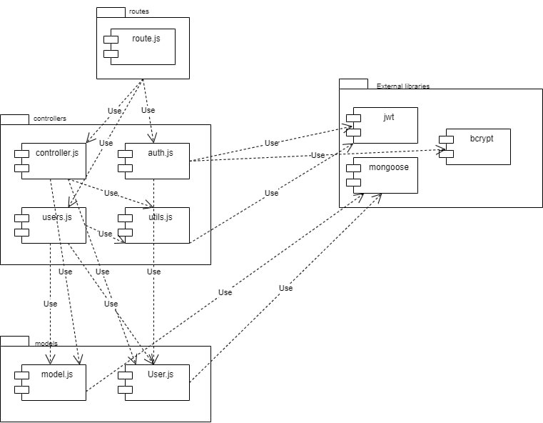
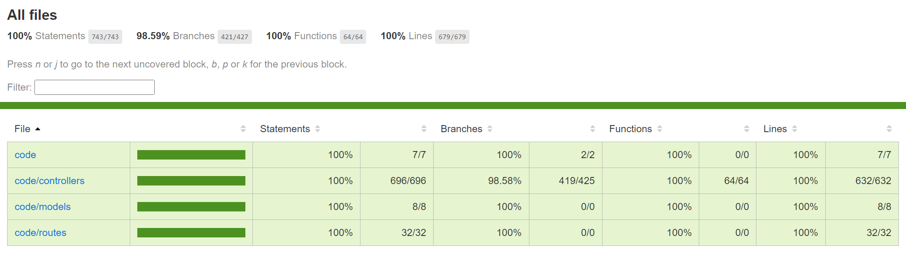

# Test Report

<The goal of this document is to explain how the application was tested, detailing how the test cases were defined and what they cover>

# Contents

- [Test Report](#test-report)
- [Contents](#contents)
- [Dependency graph](#dependency-graph)
- [Integration approach](#integration-approach)
- [Tests](#tests)
- [Coverage](#coverage)
  - [Coverage of FR](#coverage-of-fr)
  - [Coverage white box](#coverage-white-box)

# Dependency graph 

     
# Integration approach

We adopted a bottom-up approach. We started by developing tests for infividual functions seperately (unit tests). Once we verified that all the tests run successfully, we moved to the integration testing phase to verify correct interaction between functions (correct arguments and return values). We followed the following steps :

step1 : unit tests for all functions, 
step2 : integration tests for utils functions (verifyAuthGroup/verifyAuthUser/verifyAuthAdmin + verifyAuth)
step3 : integration test for route + users/controllers/auth functions + utils functions

We skipped the step of testing integration between the route object and the controllers cause this part is handled by an external library (Express.js) so we expect it to function correctly. The same applies for database (mongooseJs) and jwt functions (jsonwebtoken)

# Tests

| Test case name | Object(s) tested | Test level | Technique used |
|--|--|--|--|
|   register    U1    | register    | unit|WB statement coverage|
|   register    U2    | register    | unit| WB statement coverage|
|   register    U3    | register    | unit|WB statement coverage|
|   register    U4    | register    | unit| WB statement coverage|
|   register    U5    | register    | unit|WB statement coverage|
|   register    U6    | register    | unit| WB statement coverage|
|   registerAdmin    U1    | registerAdmin    | unit|WB statement coverage|
|   registerAdmin    U2    | registerAdmin    | unit| WB statement coverage|
|   registerAdmin    U3    | registerAdmin    | unit|WB statement coverage|
|   registerAdmin    U4    | registerAdmin    | unit| WB statement coverage|
|   registerAdmin    U5    | registerAdmin    | unit|WB statement coverage|
|   registerAdmin    U6    | registerAdmin    | unit| WB statement coverage|
|   login    U1    | login    | unit| WB statement coverage|
|   login    U2    | login    | unit| WB statement coverage|
|   login    U3    | login    | unit| WB statement coverage|
|   login    U4    | login    | unit| WB statement coverage|
|   login    U5    | login    | unit| WB statement coverage|
|   login    U6    | login    | unit| WB statement coverage|
|   login    U7    | login    | unit| WB statement coverage|
|   logout   U1   |  logout   | unit| WB statement coverage|
|   logout   U2   |  logout   | unit| WB statement coverage|
|   logout   U3   |  logout   | unit| WB statement coverage|
|   logout   U4   |  logout   | unit| WB statement coverage|
|   register    I1    | register, User.findOne User.create  | integration|BB/ eq partitioning|
|   register    I2    | register, User.findOne    | integration|BB/ eq partitioning|
|   register    I3    | register, User.findOne    | integration|BB/ eq partitioning|
|   register    I4    | register, User.findOne   | integration|BB/ eq partitioning|
|   register    I5    | register, User.findOne    | integration|BB/ eq partitioning|
|   registerAdmin    I1    | registerAdmin, User.findOne User.create  | integration|BB/ eq partitioning|
|   registerAdmin    I2    | registerAdmin, User.findOne    | integration|BB/ eq partitioning|
|   registerAdmin    I3    | registerAdmin, User.findOne    | integration|BB/ eq partitioning|
|   registerAdmin    I4    | registerAdmin, User.findOne   | integration|BB/ eq partitioning|
|   registerAdmin    I5    | registerAdmin, User.findOne    | integration|BB/ eq partitioning|
|   login    I1    | login, User.findOne, bcrypt.compare, jwt.sign, jwt.sign   | integration| BB/ eq partitioning|
|   login    I2    | login, User.findOne  | integration| BB/ eq partitioning|
|   login    I3    | login, User.findOne  | integration| BB/ eq partitioning|
|   login    I4    | login | integration| BB/ eq partitioning|
|   login    I5    | login | integration| BB/ eq partitioning|
|   login    I6    | login, User.findOne, bcrypt.compare | integration| BB/ eq partitioning|
|   logout    I1    | logout, User.findOne, user.save | integration| BB/ eq partitioning|
|   logout    I2    | logout | integration| BB/ eq partitioning|
|   logout    I3    | logout, User.findOne | integration| BB/ eq partitioning|
|  getUsers U1| getUsers | unit | WB statement coverage|
|  getUsers U2| getUsers | unit | WB statement coverage|
|  getUsers U3| getUsers | unit | WB statement coverage|
|  getUsers U4| getUsers | unit | WB statement coverage|
|  getUser U1| getUser | unit | WB statement coverage|
|  getUser U2| getUser | unit | WB statement coverage|
|  getUser U3| getUser | unit | WB statement coverage|
|  getUser U4| getUser | unit | WB statement coverage|
|   createGroup U1             | createGroup                                           |unit       |WB statement coverage|
|   createGroup U2             | createGroup                                           |unit       |WB statement coverage|
|   createGroup U3             | createGroup                                           |unit       |WB statement coverage|
|   createGroup U4             | createGroup                                           |unit       |WB statement coverage|
|   createGroup U5             | createGroup                                           |unit       |WB statement coverage|
|   createGroup U6             | createGroup                                           |unit       |WB statement coverage|
|   createGroup U7             | createGroup                                           |unit       |WB statement coverage|
|   createGroup U8             | createGroup                                           |unit       |WB statement coverage|
|   createGroup U9             | createGroup                                           |unit       |WB statement coverage|
|   createGroup U10            | createGroup                                           |unit       |WB statement coverage|
|   createGroup U11            | createGroup                                           |unit       |WB statement coverage|
|   createGroup U12            | createGroup                                           |unit       |WB statement coverage|
|   createGroup U13            | createGroup                                           |unit       |WB statement coverage|
|   createGroup U14            | createGroup                                           |unit       |WB statement coverage|
| getGroups U1 | getGroups | unit | WB statement coverage|
| getGroups U2 | getGroups | unit | WB statement coverage|
| getGroups U3 | getGroups | unit | WB statement coverage|
| getGroups U4 | getGroups | unit | WB statement coverage|
| getGroup U1 | getGroup | unit | WB statement coverage|
| getGroup U2 | getGroup | unit | WB statement coverage|
| getGroup U3 | getGroup | unit | WB statement coverage|
| getGroup U4 | getGroup | unit | WB statement coverage|
|   addToGroup U1              | addToGroup                                            |unit       |WB statement coverage|
|   addToGroup U2              | addToGroup                                            |unit       |WB statement coverage|
|   addToGroup U3              | addToGroup                                            |unit       |WB statement coverage|
|   addToGroup U4              | addToGroup                                            |unit       |WB statement coverage|
|   addToGroup U5              | addToGroup                                            |unit       |WB statement coverage|
|   addToGroup U6              | addToGroup                                            |unit       |WB statement coverage|
|   addToGroup U7              | addToGroup                                            |unit       |WB statement coverage|
|   addToGroup U8              | addToGroup                                            |unit       |WB statement coverage|
|   addToGroup U9              | addToGroup                                            |unit       |WB statement coverage|
|   addToGroup U10             | addToGroup                                            |unit       |WB statement coverage|
|   addToGroup U11             | addToGroup                                            |unit       |WB statement coverage|
|removeFromGroup U1| removeFromGroup | unit | WB statement coverage|
|removeFromGroup U2| removeFromGroup | unit | WB statement coverage|
|removeFromGroup U3| removeFromGroup | unit | WB statement coverage|
|removeFromGroup U4| removeFromGroup | unit | WB statement coverage|
|removeFromGroup U5| removeFromGroup | unit | WB statement coverage|
|removeFromGroup U6| removeFromGroup | unit | WB statement coverage|
|removeFromGroup U7| removeFromGroup | unit | WB statement coverage|
|removeFromGroup U8| removeFromGroup | unit | WB statement coverage|
|removeFromGroup U9| removeFromGroup | unit | WB statement coverage|
|removeFromGroup U10| removeFromGroup | unit | WB statement coverage|
| deleteUser U1| deleteUser | unit |  WB statement coverage|
| deleteUser U2| deleteUser | unit |  WB statement coverage|
| deleteUser U3| deleteUser | unit |  WB statement coverage|
| deleteUser U4| deleteUser | unit |  WB statement coverage|
| deleteUser U5| deleteUser | unit |  WB statement coverage|
| deleteUser U6| deleteUser | unit |  WB statement coverage|
| deleteUser U7| deleteUser | unit |  WB statement coverage|
| deleteUser U8| deleteUser | unit |  WB statement coverage|
| deleteUser U9| deleteUser | unit |  WB statement coverage|
| deleteUser U10| deleteUser | unit |  WB statement coverage|
| deleteGroup U1| deleteGroup | unit |  WB statement coverage|
| deleteGroup U2| deleteGroup | unit |  WB statement coverage|
| deleteGroup U3| deleteGroup | unit |  WB statement coverage|
| deleteGroup U4| deleteGroup | unit |  WB statement coverage|
| deleteGroup U5| deleteGroup | unit |  WB statement coverage|
| deleteGroup U6| deleteGroup | unit |  WB statement coverage|
|  getUsers I1|  getUsers, verifyAuthAdmin,User.find | integration | WB statement coverage|
|  getUsers I2| getUsers, verifyAuthAdmin,User.find | integration | WB statement coverage|
|  getUsers I3| getUsers, verifyAuthAdmin | integration | WB statement coverage|
|  getUser I1| getUsers, verifyAuthUser, verifyAuthAdmin, User.findOne,   | integration | WB statement coverage|
|  getUser I2| getUsers, verifyAuthUser, verifyAuthAdmin, User.findOne  | integration | WB statement coverage|
|  getUser I3| getUsers, verifyAuthUser, verifyAuthAdmin, User.findOne | integration | WB statement coverage|
|  getUser I4| getUsers, User.findOne | integration | WB statement coverage|
|   createGroup I1             | createGroup, verifyAuthSimple                               |integration|BB/ eq partitioning  |
|   createGroup I2             | createGroup, verifyAuthSimple                               |integration|BB/ eq partitioning  |
|   createGroup I3             | createGroup, verifyAuthSimple                               |integration|BB/ eq partitioning  |
|   createGroup I4             | createGroup, verifyAuthSimple, User.findOne, Group.findOne  |integration|BB/ eq partitioning  |
|   createGroup I5             | createGroup, verifyAuthSimple, User.findOne, Group.findOne  |integration|BB/ eq partitioning  |
|   createGroup I6             | createGroup, verifyAuthSimple, User.findOne, Group.findOne  |integration|BB/ eq partitioning  |
|   createGroup I7             | createGroup, verifyAuthSimple, User.findOne, Group.findOne  |integration|BB/ eq partitioning  |
|   createGroup I8             | createGroup, verifyAuthSimple                               |integration|BB/ eq partitioning  |
|   createGroup I9             | createGroup, verifyAuthSimple                               |integration|BB/ eq partitioning  |
|   createGroup I10            | createGroup, verifyAuthSimple, User.findOne, Group.findOne  |integration|BB/ eq partitioning  |
| getGroups I1 | getGroups, verifyAuthAdmin, Groups.find | integration | BB/ eq partitioning|
| getGroups I2 | getGroups, verifyAuthAdmin | integration | BB/ eq partitioning|
| getGroup I1 | getGroup, verifyAuthAdmin, verifyAuthGroup, Group.findOne | integration | BB/ eq partitioning| 
| getGroup I2 | getGroup, verifyAuthAdmin, verifyAuthGroup, Group.findOne | integration | BB/ eq partitioning| 
| getGroup I3 | getGroup, verifyAuthAdmin, verifyAuthGroup | integration | BB/ eq partitioning| 
| getGroup I4 | getGroup, verifyAuthAdmin, verifyAuthGroup, Group.findOne | integration | BB/ eq partitioning|
|   addToGroup I1              | addToGroup, verifyAuthGroup, verifyAuthAdmin                                |integration|BB/ eq partitioning  |
|   addToGroup I2              | addToGroup, verifyAuthGroup, verifyAuthAdmin                                |integration|BB/ eq partitioning  |
|   addToGroup I3              | addToGroup, verifyAuthGroup, verifyAuthAdmin                                |integration|BB/ eq partitioning  |
|   addToGroup I4              | addToGroup, verifyAuthGroup, verifyAuthAdmin                                |integration|BB/ eq partitioning  |
|   addToGroup I5              | addToGroup, verifyAuthGroup, verifyAuthAdmin                                |integration|BB/ eq partitioning  |
|   addToGroup I6              | addToGroup, verifyAuthGroup, verifyAuthAdmin                                |integration|BB/ eq partitioning  |
|   addToGroup I7              | addToGroup, verifyAuthGroup, verifyAuthAdmin, Group.findOne, User.findOne   |integration|BB/ eq partitioning  |
|   addToGroup I8              | addToGroup, verifyAuthGroup, verifyAuthAdmin, Group.findOne, User.findOne   |integration|BB/ eq partitioning  |
|   addToGroup I9              | addToGroup, verifyAuthGroup, verifyAuthAdmin, Group.findOne, User.findOne   |integration|BB/ eq partitioning  |
|   addToGroup I10             | addToGroup, verifyAuthGroup, verifyAuthAdmin, Group.findOne, User.findOne   |integration|BB/ eq partitioning  |
|   removeFromGroup I1| removeFromGroup, verifyAuthAdmin, Group.findOne, User.findOne, Group.updateOne  |integration|BB/ eq partitioning|integration|BB/ eq partitioning|
|   removeFromGroup I2| removeFromGroup, verifyAuthAdmin |integration|BB/ eq partitioning|
|   removeFromGroup I3| removeFromGroup, verifyAuthAdmin  |integration|BB/ eq partitioning||   removeFromGroup I4| |integration|BB/ eq partitioning|
|   removeFromGroup I4| removeFromGroup, verifyAuthAdmin |integration|BB/ eq partitioning|
|   removeFromGroup I5| removeFromGroup, verifyAuthAdmin |integration|BB/ eq partitioning||   removeFromGroup I6| |integration|BB/ eq partitioning|
|   removeFromGroup I6| removeFromGroup, verifyAuthAdmin, Group.findOne  |integration|BB/ eq partitioning|
|   removeFromGroup I7| removeFromGroup, verifyAuthAdmin, Group.findOne  |integration|BB/ eq partitioning|
|   removeFromGroup I8| removeFromGroup, verifyAuthGroup, Group.findOne, User.findOne   |integration|BB/ eq partitioning|
|   removeFromGroup I9| removeFromGroup, verifyAuthGroup, Group.findOne, User.findOne, Group.updateOne |integration|BB/ eq partitioning|
|   removeFromGroup I10| removeFromGroup, verifyAuthGroup |integration|BB/ eq partitioning|
|   removeFromGroup I11| removeFromGroup, verifyAuthGroup |integration|BB/ eq partitioning|
|   removeFromGroup I12| removeFromGroup, verifyAuthGroup |integration|BB/ eq partitioning|
|   removeFromGroup I13| removeFromGroup, verifyAuthGroup |integration|BB/ eq partitioning|
|   removeFromGroup I14|  removeFromGroup, verifyAuthGroup, Group.findOne |integration|BB/ eq partitioning|
|   removeFromGroup I15| removeFromGroup, verifyAuthGroup, Group.findOne |integration|BB/ eq partitioning|
|   removeFromGroup I16| removeFromGroup, verifyAuthGroup, Group.findOne, User.findOne |integration|BB/ eq partitioning| 
|   removeFromGroup I17| removeFromGroup, verifyAuthGroup, Group.findOne, User.findOne |integration|BB/ eq partitioning| 
|deleteUser I1| deleteUser, verifyAuthAdmin, User.findOne, User.deleteOne, transations.deleteMany, Group.findOne| integration | BB/ eq partitioning|
|deleteUser I2| deleteUser, verifyAuthAdmin, User.findOne, User.deleteOne, transations.deleteMany, Group.findOne, Group.deleteOne, group.save | integration | BB/ eq partitioning|
|deleteUser I3| deleteUser, verifyAuthAdmin, User.findOne, User.deleteOne, transations.deleteMany, Group.findOne | integration | BB/ eq partitioning|
|deleteUser I4| deleteUser, verifyAuthAdmin | integration | BB/ eq partitioning|
|deleteUser I5| deleteUser, verifyAuthAdmin | integration | BB/ eq partitioning|
|deleteUser I6| deleteUser, verifyAuthAdmin, User.findOne | integration | BB/ eq partitioning|
|deleteUser I7| deleteUser, verifyAuthAdmin | integration | BB/ eq partitioning|
|deleteUser I8| deleteUser, verifyAuthAdmin | integration | BB/ eq partitioning|
|deleteUser I9| deleteUser, verifyAuthAdmin, User.findOne | integration | BB/ eq partitioning|
| deleteGroup I1 | deleteGroup, verifyAuthAdmin, Group.findOne, Group.deleteOne  | integration |BB/ eq partitioning|
| deleteGroup I2 | deleteGroup, verifyAuthAdmin | integration |BB/ eq partitioning|
| deleteGroup I3 | deleteGroup, verifyAuthAdmin | integration |BB/ eq partitioning|
| deleteGroup I4 | deleteGroup, verifyAuthAdmin, Group.findOne  | integration |BB/ eq partitioning|
| deleteGroup I5 | deleteGroup, verifyAuthAdmin | integration |BB/ eq partitioning|
|   createCategory U1| createCategory |unit|WB/ statement coverage|
|   createCategory U2| createCategory |unit|WB/ statement coverage|
|   createCategory U3| createCategory |unit|WB/ statement coverage|
|   createCategory U4| createCategory |unit|WB/ statement coverage|
|   createCategory U5| createCategory |unit|WB/ statement coverage|
|   createCategory U6| createCategory |unit|WB/ statement coverage|
|   createCategory U7| createCategory |unit|WB/ statement coverage|
|   createCategory U8| createCategory |unit|WB/ statement coverage|
|   updateCategory U1| updateCategory |unit|WB/ statement coverage|
|   updateCategory U2| updateCategory |unit|WB/ statement coverage|
|   updateCategory U3| updateCategory |unit|WB/ statement coverage|
|   updateCategory U4| updateCategory |unit|WB/ statement coverage|
|   updateCategory U5| updateCategory |unit|WB/ statement coverage|
|   updateCategory U6| updateCategory |unit|WB/ statement coverage|
|   updateCategory U7| updateCategory |unit|WB/ statement coverage|
|   updateCategory U8| updateCategory |unit|WB/ statement coverage|
|   updateCategory U9| updateCategory |unit|WB/ statement coverage|
|   deleteCategory U1| deleteCategory |unit|WB/ statement coverage|
|   deleteCategory U2| deleteCategory |unit|WB/ statement coverage|
|   deleteCategory U3| deleteCategory |unit|WB/ statement coverage|
|   deleteCategory U4| deleteCategory |unit|WB/ statement coverage|
|   deleteCategory U5| deleteCategory |unit|WB/ statement coverage|
|   deleteCategory U6| deleteCategory |unit|WB/ statement coverage|
|   deleteCategory U7| deleteCategory |unit|WB/ statement coverage|
|   deleteCategory U8| deleteCategory |unit|WB/ statement coverage|
|   getCategories U1| getCategories |unit|WB/ statement coverage|
|   getCategories U2| getCategories |unit|WB/ statement coverage|
|   getCategories U3| getCategories |unit|WB/ statement coverage|
|   createTransaction U1| createTransaction |unit|WB/ statement coverage|
|   createTransaction U2| createTransaction |unit|WB/ statement coverage|
|   createTransaction U3| createTransaction |unit|WB/ statement coverage|
|   createTransaction U4| createTransaction |unit|WB/ statement coverage|
|   createTransaction U5| createTransaction |unit|WB/ statement coverage|
|   createTransaction U6| createTransaction |unit|WB/ statement coverage|
|   createTransaction U7| createTransaction |unit|WB/ statement coverage|
|   createTransaction U8| createTransaction |unit|WB/ statement coverage|
|   createTransaction U9| createTransaction |unit|WB/ statement coverage|
|   createTransaction U10| createTransaction |unit|WB/ statement coverage|
|   createTransaction U11| createTransaction |unit|WB/ statement coverage|
|   createTransaction U12| createTransaction |unit|WB/ statement coverage|
|   createTransaction U13| createTransaction |unit|WB/ statement coverage|
|   getAllTransactions U1      | getAllTransactions                                    |unit       |WB statement coverage|
|   getAllTransactions U2      | getAllTransactions                                    |unit       |WB statement coverage|
|   getAllTransactions U3      | getAllTransactions                                    |unit       |WB statement coverage|
|   getAllTransactions U4      | getAllTransactions                                    |unit       |WB statement coverage|
|   createCategory I1| createCategory, verifyAuthAdmin, categories.countDocuments, categories.save |integration|BB/ eq partitioning|
|   createCategory I2| createCategory, verifyAuthAdmin |integration|BB/ eq partitioning|
|   createCategory I3|createCategory, verifyAuthAdmin|integration|BB/ eq partitioning|
|   createCategory I4|createCategory, verifyAuthAdmin|integration|BB/ eq partitioning|
|   createCategory I5|createCategory, verifyAuthAdmin|integration|BB/ eq partitioning|
|   createCategory I6|createCategory, verifyAuthAdmin|integration|BB/ eq partitioning|
|   createCategory I7|createCategory, verifyAuthAdmin, categories.countDocuments|integration|BB/ eq partitioning|
|   updateCategory I1|updateCategory, verifyAuthAdmin, categories.countDocuments, categories.updateOne, transactions.updateMany  |integration|BB/ eq partitioning|
|   updateCategory I2|updateCategory, verifyAuthAdmin|integration|BB/ eq partitioning|
|   updateCategory I3|updateCategory, verifyAuthAdmin|integration|BB/ eq partitioning|
|   updateCategory I4|updateCategory, verifyAuthAdmin|integration|BB/ eq partitioning|
|   updateCategory I5|updateCategory, verifyAuthAdmin|integration|BB/ eq partitioning|
|   updateCategory I6|updateCategory, verifyAuthAdmin|integration|BB/ eq partitioning|
|   updateCategory I7|updateCategory, verifyAuthAdmin, categories.countDocuments|integration|BB/ eq partitioning|
|   updateCategory I8|updateCategory, verifyAuthAdmin, categories.countDocuments, categories.updateOne|integration|BB/ eq partitioning|
|   deleteCategory I1|deleteCategory, verifyAuthAdmin, categories.countDocuments, categories.find, categories.deleteMany, transactions.updateMany  |integration|BB/ eq partitioning|
|   deleteCategory I2| deleteCategory, verifyAuthAdmin |integration|BB/ eq partitioning|
|   deleteCategory I3|deleteCategory, verifyAuthAdmin|integration|BB/ eq partitioning|
|   deleteCategory I4|deleteCategory, verifyAuthAdmin|integration|BB/ eq partitioning|
|   deleteCategory I5| deleteCategory, verifyAuthAdmin, categories.countDocuments|integration|BB/ eq partitioning|
|   deleteCategory I6| deleteCategory, verifyAuthAdmin, categories.countDocuments, categories.find|integration|BB/ eq partitioning|
|   getCategories I1|getCategories, verifyAuthSimple, categories.find|integration|BB/ eq partitioning|
|   getCategories I2|getCategories, verifyAuthSimple|integration|BB/ eq partitioning|
|   createTransaction I1|createTransaction, verifyAuthUser, categories.countDocuments, User.countDocuments, transactions.save |integration|BB/ eq partitioning|
|   createTransaction I2|createTransaction, verifyAuthUser |integration|BB/ eq partitioning|
|   createTransaction I3|createTransaction, verifyAuthUser |integration|BB/ eq partitioning|
|   createTransaction I4|createTransaction, verifyAuthUser |integration|BB/ eq partitioning|
|   createTransaction I5|createTransaction, verifyAuthUser |integration|BB/ eq partitioning|
|   createTransaction I6|createTransaction, verifyAuthUser |integration|BB/ eq partitioning|
|   createTransaction I7|createTransaction, verifyAuthUser |integration|BB/ eq partitioning|
|   createTransaction I8|createTransaction, verifyAuthUser |integration|BB/ eq partitioning|
|   createTransaction I9|createTransaction, verifyAuthUser |integration|BB/ eq partitioning|
|   createTransaction I10|createTransaction, verifyAuthUser |integration|BB/ eq partitioning|
|   createTransaction I11|createTransaction, verifyAuthUser, categories.countDocuments |integration|BB/ eq partitioning|
|   createTransaction I12|createTransaction, verifyAuthUser, categories.countDocuments, User.countDocuments  |integration|BB/ eq partitioning|
|   getAllTransactions I1      | getAllTransactions, verifyAuthAdmin, transactions.aggregate|integration|WB statement coverage|
|   getAllTransactions I2      | getAllTransactions, verifyAuthAdmin, transactions.aggregate|integration|WB statement coverage|
|   getAllTransactions I3      | getAllTransactions, verifyAuthAdmin                        |integration|WB statement coverage|
|   verifyAuth U1              | verifyAuth                                            |unit       |WB statement coverage|
|   verifyAuth U2              | verifyAuth                                            |unit       |WB statement coverage|
|   verifyAuth U3              | verifyAuth                                            |unit       |WB statement coverage|
|   verifyAuth U4              | verifyAuth                                            |unit       |WB statement coverage|
|   verifyAuth U5              | verifyAuth                                            |unit       |WB statement coverage|
|   verifyAuth U6              | verifyAuth                                            |unit       |WB statement coverage|
|   verifyAuth U7              | verifyAuth                                            |unit       |WB statement coverage|
|   verifyAuth U8              | verifyAuth                                            |unit       |WB statement coverage|
|   verifyAuth U9              | verifyAuth                                            |unit       |WB statement coverage|
|   verifyAuth U10             | verifyAuth                                            |unit       |WB statement coverage|
|   verifyAuth U11             | verifyAuth                                            |unit       |WB statement coverage|
|   verifyAuth U12             | verifyAuth                                            |unit       |WB statement coverage|
|   verifyAuth U13             | verifyAuth                                            |unit       |WB statement coverage|
|   verifyAuth U14             | verifyAuth                                            |unit       |WB statement coverage|
|   verifyAuth U15             | verifyAuth                                            |unit       |WB statement coverage|
|   verifyAuth U16             | verifyAuth                                            |unit       |WB statement coverage|
|   verifyAuth U17             | verifyAuth                                            |unit       |WB statement coverage|
|   verifyAuth U18             | verifyAuth                                            |unit       |WB statement coverage|
|   verifyAuth U19             | verifyAuth                                            |unit       |WB statement coverage|
|   verifyAuth U20             | verifyAuth                                            |unit       |WB statement coverage|
|   verifyAuth U21             | verifyAuth                                            |unit       |WB statement coverage|
|   verifyAuth U22             | verifyAuth                                            |unit       |WB statement coverage|
|   verifyAuth U23             | verifyAuth                                            |unit       |WB statement coverage|
|   verifyAuth U24             | verifyAuth                                            |unit       |WB statement coverage|
|   handleDateFilterParams U1  |handleDateFilterParams                                 |unit       |WB statement coverage|
|   handleDateFilterParams U2  |handleDateFilterParams                                 |unit       |WB statement coverage|
|   handleDateFilterParams U3  |handleDateFilterParams                                 |unit       |WB statement coverage|
|   handleDateFilterParams U4  |handleDateFilterParams                                 |unit       |WB statement coverage|
|   handleDateFilterParams U5  |handleDateFilterParams                                 |unit       |WB statement coverage|
|   handleDateFilterParams U6  |handleDateFilterParams                                 |unit       |WB statement coverage|
|   handleDateFilterParams U7  |handleDateFilterParams                                 |unit       |WB statement coverage|
|   handleDateFilterParams U8  |handleDateFilterParams                                 |unit       |WB statement coverage|
|   handleDateFilterParams U9  |handleDateFilterParams                                 |unit       |WB statement coverage|
|   handleDateFilterParams U10 |handleDateFilterParams                                 |unit       |WB statement coverage|
|   handleAmountFilterParams U1|handleAmountFilterParams                               |unit       |WB statement coverage|
|   handleAmountFilterParams U2|handleAmountFilterParams                               |unit       |WB statement coverage|
|   handleAmountFilterParams U3|handleAmountFilterParams                               |unit       |WB statement coverage|
|   handleAmountFilterParams U4|handleAmountFilterParams                               |unit       |WB statement coverage|
|   handleAmountFilterParams U5|handleAmountFilterParams                               |unit       |WB statement coverage|
|   verifyAuth I1              | verifyAuth                                            |integration|BB/ eq partitioning  |
|   verifyAuth I2              | verifyAuth                                            |integration|BB/ eq partitioning  |
|   verifyAuth I3              | verifyAuth                                            |integration|BB/ eq partitioning  |
|   verifyAuth I4              | verifyAuth                                            |integration|BB/ eq partitioning  |
|   verifyAuth I5              | verifyAuth                                            |integration|BB/ eq partitioning  |
|   verifyAuth I6              | verifyAuth                                            |integration|BB/ eq partitioning  |
|   verifyAuth I7              | verifyAuth                                            |integration|BB/ eq partitioning  |
|   verifyAuth I8              | verifyAuth                                            |integration|BB/ eq partitioning  |
|   verifyAuth I9              | verifyAuth                                            |integration|BB/ eq partitioning  |
|   verifyAuth I10             | verifyAuth                                            |integration|BB/ eq partitioning  |
|   verifyAuth I11             | verifyAuth                                            |integration|BB/ eq partitioning  |
|   verifyAuth I12             | verifyAuth                                            |integration|BB/ eq partitioning  |
|   verifyAuth I13             | verifyAuth                                            |integration|BB/ eq partitioning  |
|   verifyAuth I14             | verifyAuth                                            |integration|BB/ eq partitioning  |
|   verifyAuth I15             | verifyAuth                                            |integration|BB/ eq partitioning  |
|   verifyAuth I16             | verifyAuth                                            |integration|BB/ eq partitioning  |
|   verifyAuth I17             | verifyAuth                                            |integration|BB/ eq partitioning  |
| getTransactionsByUser U1   |getTransactionsByUser|unit|WB statement coverage|
| getTransactionsByUser U2   |getTransactionsByUser|unit|WB statement coverage|
| getTransactionsByUser U3   |getTransactionsByUser|unit|WB statement coverage|
| getTransactionsByUser U4   |getTransactionsByUser|unit|WB statement coverage|
| getTransactionsByUser U5   |getTransactionsByUser|unit|WB statement coverage|
| getTransactionsByUser U6   |getTransactionsByUser|unit|WB statement coverage|
| getTransactionsByUser U7   |getTransactionsByUser|unit|WB statement coverage|
| getTransactionsByUser U8   |getTransactionsByUser|unit|WB statement coverage|
| getTransactionsByUser U9   |getTransactionsByUser|unit|WB statement coverage|
| getTransactionsByUserByCategory U1   |getTransactionsByUserByCategory|unit|WB statement coverage|
| getTransactionsByUserByCategory U2   |getTransactionsByUserByCategory|unit|WB statement coverage|
| getTransactionsByUserByCategory U3   |getTransactionsByUserByCategory|unit|WB statement coverage|
| getTransactionsByUserByCategory U4   |getTransactionsByUserByCategory|unit|WB statement coverage|
| getTransactionsByUserByCategory U5   |getTransactionsByUserByCategory|unit|WB statement coverage|
| getTransactionsByUserByCategory U6   |getTransactionsByUserByCategory|unit|WB statement coverage|
| getTransactionsByUserByCategory U7   |getTransactionsByUserByCategory|unit|WB statement coverage|
| getTransactionsByGroup U1   |getTransactionsByGroup|unit|WB statement coverage|
| getTransactionsByGroup U2   |getTransactionsByGroup|unit|WB statement coverage|
| getTransactionsByGroup U3   |getTransactionsByGroup|unit|WB statement coverage|
| getTransactionsByGroup U4   |getTransactionsByGroup|unit|WB statement coverage|
| getTransactionsByGroup U5   |getTransactionsByGroup|unit|WB statement coverage|
| getTransactionsByGroup U6   |getTransactionsByGroup|unit|WB statement coverage|
| getTransactionsByGroupByCategory U1   |getTransactionsByGroupByCategory|unit|WB statement coverage|
| getTransactionsByGroupByCategory U2   |getTransactionsByGroupByCategory|unit|WB statement coverage|
| getTransactionsByGroupByCategory U3   |getTransactionsByGroupByCategory|unit|WB statement coverage|
| getTransactionsByGroupByCategory U4   |getTransactionsByGroupByCategory|unit|WB statement coverage|
| getTransactionsByGroupByCategory U5   |getTransactionsByGroupByCategory|unit|WB statement coverage|
| getTransactionsByGroupByCategory U6   |getTransactionsByGroupByCategory|unit|WB statement coverage|
| getTransactionsByGroupByCategory U7   |getTransactionsByGroupByCategory|unit|WB statement coverage|
| getTransactionsByGroupByCategory U8   |getTransactionsByGroupByCategory|unit|WB statement coverage|
| deleteTransaction U1   |deleteTransaction|unit|WB statement coverage|
| deleteTransaction U2   |deleteTransaction|unit|WB statement coverage|
| deleteTransaction U3   |deleteTransaction|unit|WB statement coverage|
| deleteTransaction U4   |deleteTransaction|unit|WB statement coverage|
| deleteTransaction U5   |deleteTransaction|unit|WB statement coverage|
| deleteTransaction U6   |deleteTransaction|unit|WB statement coverage|
| deleteTransaction U7   |deleteTransaction|unit|WB statement coverage|
| deleteTransaction U8   |deleteTransaction|unit|WB statement coverage|
| deleteTransactions U1   |deleteTransactions|unit|WB statement coverage|
| deleteTransactions U2   |deleteTransactions|unit|WB statement coverage|
| deleteTransactions U3   |deleteTransactions|unit|WB statement coverage|
| deleteTransactions U4   |deleteTransactions|unit|WB statement coverage|
| deleteTransactions U5   |deleteTransactions|unit|WB statement coverage|
| deleteTransactions U6   |deleteTransactions|unit|WB statement coverage|
| deleteTransactions U7   |deleteTransactions|unit|WB statement coverage|
| getTransactionsByUser I1   |verifyAuthUser|integration|BB/ eq partitioning|
| getTransactionsByUser I2   |verifyAuthUser, User.countDocuments|integration|BB/ eq partitioning|
| getTransactionsByUser I3   |verifyAuthAdmin|integration|BB/ eq partitioning|
| getTransactionsByUser I4   |verifyAuthAdmin, User.countDocuments|integration|BB/ eq partitioning|
| getTransactionsByUser I5   |verifyAuthAdmin, User.countDocuments, transactions.aggregate|integration|BB/ eq partitioning|
| getTransactionsByUser I6   |verifyAuthUser, handleAmountFilterParams, handleDateFilterParams, User.countDocuments, transactions.aggregate|integration|BB/ eq partitioning|
| getTransactionsByUser I7   |verifyAuthUser, handleAmountFilterParams, handleDateFilterParams, User.countDocuments, transactions.aggregate|integration|BB/ eq partitioning|
| getTransactionsByUser I8   |verifyAuthUser, handleAmountFilterParams, handleDateFilterParams, User.countDocuments, transactions.aggregate|integration|BB/ eq partitioning|
| getTransactionsByUser I9   |verifyAuthUser, handleAmountFilterParams, handleDateFilterParams, User.countDocuments, transactions.aggregate|integration|BB/ eq partitioning|
| getTransactionsByUser I10   |verifyAuthUser, handleAmountFilterParams, handleDateFilterParams, User.countDocuments, transactions.aggregate|integration|BB/ eq partitioning|
| getTransactionsByUser I11  |verifyAuthUser, handleAmountFilterParams, handleDateFilterParams, User.countDocuments, transactions.aggregate|integration|BB/ eq partitioning|
| getTransactionsByUser I12  |verifyAuthUser, handleAmountFilterParams, handleDateFilterParams, User.countDocuments, transactions.aggregate|integration|BB/ eq partitioning|
| getTransactionsByUser I13  |verifyAuthUser, handleAmountFilterParams, handleDateFilterParams, User.countDocuments, transactions.aggregate|integration|BB/ eq partitioning|
| getTransactionsByUser I14  |verifyAuthUser, handleAmountFilterParams, handleDateFilterParams, User.countDocuments, transactions.aggregate|integration|BB/ eq partitioning|
| getTransactionsByUser I15  |verifyAuthUser, handleAmountFilterParams, handleDateFilterParams, User.countDocuments, transactions.aggregate|integration|BB/ eq partitioning|
| getTransactionsByUserByCategory I1  |verifyAuthUser|integration|BB/ eq partitioning|
| getTransactionsByUserByCategory I2  |verifyAuthAdmin|integration|BB/ eq partitioning|
| getTransactionsByUserByCategory I3  |verifyAuthUser, User.countDocuments|integration|BB/ eq partitioning|
| getTransactionsByUserByCategory I4  |verifyAuthAdmin, User.countDocuments|integration|BB/ eq partitioning|
| getTransactionsByUserByCategory I5  |verifyAuthUser, User.countDocuments, categories.countDocuments|integration|BB/ eq partitioning|
| getTransactionsByUserByCategory I6  |verifyAuthAdmin, User.countDocuments, categories.countDocuments|integration|BB/ eq partitioning|
| getTransactionsByUserByCategory I7  |verifyAuthUser, User.countDocuments, categories.countDocuments, transactions.aggregate|integration|BB/ eq partitioning|
| getTransactionsByUserByCategory I8  |verifyAuthAdmin, User.countDocuments, categories.countDocuments, transactions.aggregate|integration|BB/ eq partitioning|
| getTransactionsByUserByCategory I9  |verifyAuthUser, User.countDocuments, categories.countDocuments, transactions.aggregate|integration|BB/ eq partitioning|
| getTransactionsByUserByCategory I10 |verifyAuthAdmin, User.countDocuments, categories.countDocuments, transactions.aggregate|integration|BB/ eq partitioning|
| getTransactionsByGroup I1 |verifyAuthGroup|integration|BB/ eq partitioning|
| getTransactionsByGroup I2 |verifyAuthGroup|integration|BB/ eq partitioning|
| getTransactionsByGroup I3 |verifyAuthAdmin|integration|BB/ eq partitioning|
| getTransactionsByGroup I4 |verifyAuthAdmin, Group.aggregate|integration|BB/ eq partitioning|
| getTransactionsByGroup I5 |verifyAuthGroup, Group.aggregate, transactions.aggregate|integration|BB/ eq partitioning|
| getTransactionsByGroupByCategory I1 |verifyAuthGroup|integration|BB/ eq partitioning|
| getTransactionsByGroupByCategory I2 |verifyAuthGroup|integration|BB/ eq partitioning|
| getTransactionsByGroupByCategory I3 |verifyAuthAdmin|integration|BB/ eq partitioning|
| getTransactionsByGroupByCategory I4 |verifyAuthAdmin, Group.findOne|integration|BB/ eq partitioning|
| getTransactionsByGroupByCategory I5 |verifyAuthGroup, Group.findOne, categories.findOne|integration|BB/ eq partitioning|
| getTransactionsByGroupByCategory I6 |verifyAuthGroup, Group.findOne, categories.findOne, transactions.aggregate|integration|BB/ eq partitioning|
| getTransactionsByGroupByCategory I7 |verifyAuthGroup, Group.findOne, categories.findOne, transactions.aggregate|integration|BB/ eq partitioning|
| deleteTransaction I1 |verifyAuthUser|integration|BB/ eq partitioning|
| deleteTransaction I2 |verifyAuthUser, |integration|BB/ eq partitioning|
| deleteTransaction I3 |verifyAuthUser, User.findOne|integration|BB/ eq partitioning|
| deleteTransaction I4 |verifyAuthUser, User.findOne, transactions.findOne|integration|BB/ eq partitioning|
| deleteTransaction I5 |verifyAuthUser, User.findOne, transactions.findOne, transactions.deleteOne|integration|BB/ eq partitioning|
| deleteTransaction I6 |verifyAuthUser, User.findOne, transactions.findOne, transactions.deleteOne|integration|BB/ eq partitioning|
| deleteTransactions I1 |verifyAuthAdmin|integration|BB/ eq partitioning|
| deleteTransactions I2 |verifyAuthAdmin|integration|BB/ eq partitioning|
| deleteTransactions I3 |verifyAuthAdmin|integration|BB/ eq partitioning|
| deleteTransactions I4 |verifyAuthAdmin, transactions.find, result.map|integration|BB/ eq partitioning|
| deleteTransactions I5 |verifyAuthAdmin, transactions.find, result.map, transactions.deleteMany|integration|BB/ eq partitioning|

# Coverage

## Coverage of FR

| Functional Requirements covered |   Test(s) | 
| ------------------------------- | ----------- | 
|FR1 Manage users| |
|FR11  register | register U1-U6 , register I1-I5|
|FR12 login| login U1-U7 , login I1-I6|
|FR13 logout| logout U1-U4 , logout I1-I3|
|FR14 registerAdmin |registerAdmin U1-U6 , registerAdmin I1-I5|
|FR15 getUsers | getUsers U1-U4 , getUsers I1-I3|
|FR16 getUser | getUser U1-U4 , getUser I1-I4|
|FR17 deleteUser | deleteUser U1-U10 , deleteUser I1-I9|
|FR2 Manage groups |
|FR21 createGroup |createGroup U1-U14 , createGroup I1-I9|
|FR22 getGroups| getGroups U1-U4 , getGroups I1-I2|
|FR23 getGroup | getGroup U1-U4, getGroup I1-I4|
|FR24 addToGroup| addToGroup U1-U11 , addToGroup I1-I10|
|FR26 removeFromGroup| removeFromGroup U1-U11 , I1-I17|
|FR28 deleteGroup | deleteGroup deleteGroup U1-U6 , I1-I5|   
|FR3  Manage transactions |
|   FR31 createTransaction| createTransaction U1-U13 , createTransaction I1-I12 |    
| FR32 getAllTransactions | getAllTransactions U1-U4, getAllTransactions I1-I3|       
| FR33 getTransactionsByUser  | getTransactionsByUser U1-U9, getTransactionsByUser I1-I14, handleAmountFilterParams U1-U5, handleDateFilterParams U1-U10 |
| FR34 getTransactionsByUserByCategory| getTransactionsByUserByCategory U1-U7, getTransactionsByUserByCategory I1-I10 |
| FR35 getTransactionsByGroup | getTransactionsByGroup U1-U6, getTransactionsByGroup I1-I5 |
| FR36 getTransactionsByGroupByCategory | getTransactionsByGroupByCategory U1-U8, getTransactionsByGroupByCategory I1-I7 |
| FR37 deleteTransaction | deleteTransaction U1-U8, deleteTransaction I1-I6|
| FR38 deleteTransactions | deleteTransactions U1-U7, deleteTransactions I1-I5 |
|FR4   Manage categories | 
|   FR41 createCategory| createCategory U1-U8 , createCategory I1-I7 |        
|   FR42 updateCategory| updateCategory U1-U9 , updateCategory I1-I8 |     
|   FR43 deleteCategory | deleteCategory U1-U8 , deleteCategory I1-I6 |  
|   FR44 getCategories | getCategories U1-U3 , getCategories I1-I2 |   

## Coverage white box

