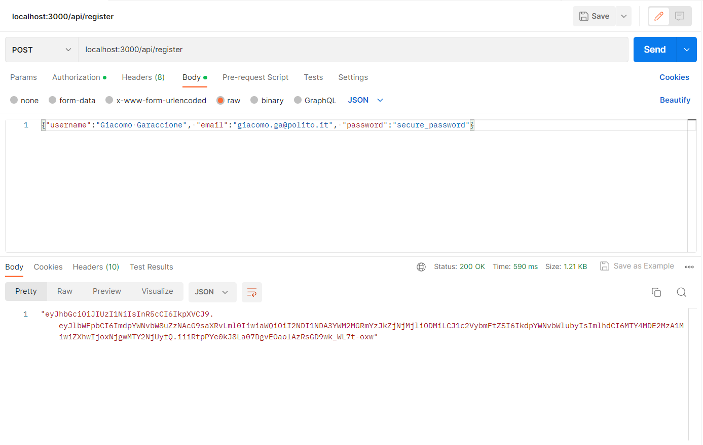
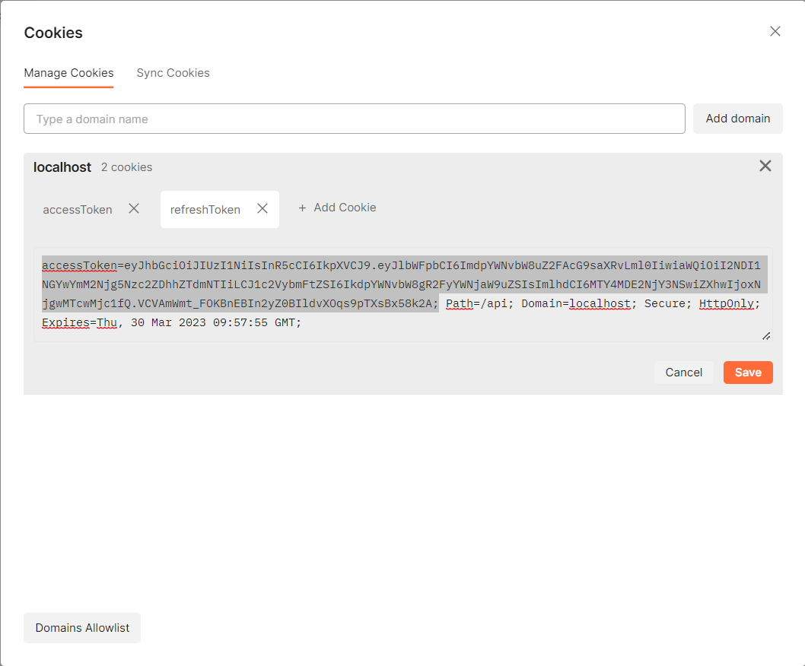
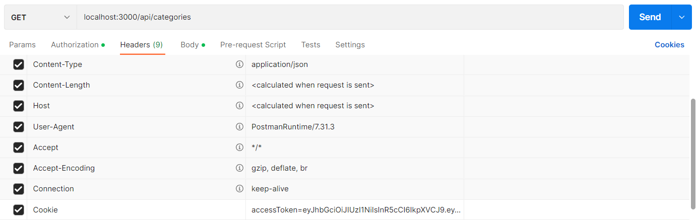
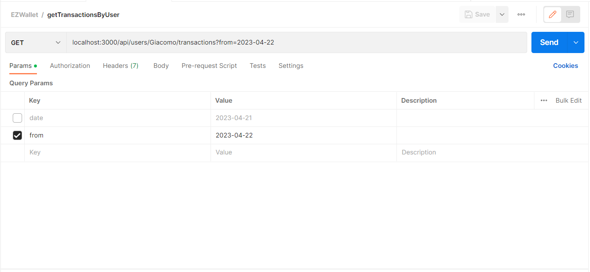
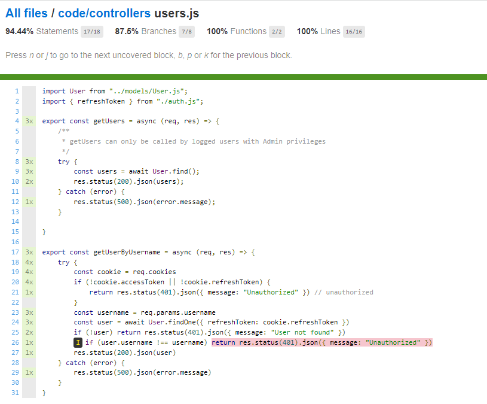

# SE-project

## Running the code locally

You need to install Node.js and MongoDB and then execute npm install on the command line. This command will install all the dependencies required by the project. Then, you can execute npm start. This command will make the Node.js backend available on the port 3000. You can call the endpoints by using Postman.
You can also run the tests by executing npm test or npm run test:coverage.
All the npm commands must be run by using the terminal opened in the root project folder called code (this folder).

### Calling the endpoints with Postman

In the Postman you can test the calls to the different endpoints by specifying the route, its parameters and the content of the body as shown in the upper section of the picture below, while the content of the response body appears in the lower section.


After performing login with the corresponding endpoint call you are able to see the cookies set for authentication by clicking on the `Cookies` button in the upper section of the screen; this will open up the menu shown below, where you can see the cookies set for the `localhost` domain.


To use cookies set after login in subsequent endpoint calls, you have to manually copy them to the `Headers` section of the page, in the format shown below. This will set the cookies to the calls you make after login and allow you to access routes that require authentication. You must always remember to change the values set in the `Headers` section after a token you are using changes value, or you will not be able to access routes anymore.


## Sequence for running the project on Docker

Before starting the process described below, download [Docker Desktop](https://www.docker.com/products/docker-desktop/)

- start `Docker Desktop`
- execute `docker compose build` from a terminal to create a container with the three images (node app, mongoDB server, node test suite)
- execute `docker compose -p ezwallet up` from a terminal to launch the container
- on `Docker Desktop -> Containers` locate the container `ezwallet`, it should contain three separate images (`db-1`, `app-1`, `test-1`)
- `test-1` ends after completing the test cases directly on the terminal, its logs can be seen on `Docker Desktop -> Containers -> ezwallet-test-1 -> Logs`
- `app-1` is the container that holds the node.js application and makes it accessible on `localhost:3000`: it is possible to access the various routes using `Postman` or other tools
- to test changes in the code directly on Docker, all the images present in the container on `Docker Desktop` must be stopped before executing `docker compose build` and `docker compose up` again
- the two commands must be launched together in this exact order after code changes, or the images will not be built with the new code
- ensure that ports 27017 and 3000 are free before executing `docker compose -p ezwallet up` with `docker ps`

## API return content

All data returned by APIs must be a JSON object with the following structure:

```json
{
  "data": { "param": "returned data" },
  "message": "message"
}
```

where `data` represents the content that the API is expected to return (array, object, value...) and `message` is an optional message that is stored in the parameter `res.locals.message`.

## Filtering of transaction APIs

The function `getTransactionsByUser` can have additional optional query parameters that allow filtering the returned transactions by date or by amount if called by a Regular user; these parameters are:

- `from`. Specifies the starting date from which transactions must be retrieved.
- `upTo`. Specifies the final date up to which transactions must be retrieved.
- `date`. Specifies the date in which transactions must be retrieved.
- `min`. Specifies the minimum amount that transactions must have to be retrieved.
- `max`. Specifies the maximum amount that transactions must have to be retrieved.

The image below shows where to set query parameters in Postman.


Filtering operations are handled by the functions `handleDateFilterParams` and `handleAmountFilterParams` located in `code/controllers/utils.js`.

## Requested Changes

The code for EZWallet V2 includes functions that must be implemented and other functions that must be corrected so that they perform as expected.
All the functions that implement the various requirements are located in the folder `code/controllers`.
The functions that were already present in V1 include the previous version's code; those functions must be edited to comply to the specified requirements, including optional behaviors.
Empty functions must be implemented so that they comply to the specified requirements.
The function `verifyAuth` located in `code/controllers/utils.js` is a special case, as it only implements the `Simple` authentication in its current state: it must be edited with additional details that check for the specific addtional criteria of the other authentication modes.

## Testing Details

The testing logic has been split into `unit` testing and `integration` testing, with separate test files for each type.
It is possible to test each type independently with the commands `npm run test:unit` or `npm run test:integration`: each command will only execute the specific test files, allowing to better split the way tests are handled.
Executing test commands will also generate the following folder and files:

```
ezwallet
└── code
    └── coverage
        ├── coverage_unit
        |   └── lcov_report
        |       └── index.html
        ├── coverage_integration
        |   └── lcov_report
        |       └── index.html
        └── lcov_report
            └── index.html
```

Each `index.html` file opens an HTML page where it is possible to view the detailed report of the code coverage, showing for each file the lines covered by test cases and the lines that are still missing. The image below shows an example based on the V1 test cases.


The files `users.unit.test.js` and `users.integration.test.js` contain two examples of how to set up test cases for the respective type; keep in mind that they refer to a function whose implementation is not complete for V2's requirement, and will have to be changed as a consequence after the function has been implemented correctly.
The Gitlab CI will not distinguish between unit and integration testing, as it will execute `npm run test:coverage` and execute all test files together; moreover, if there is at least one failing test case among all the test files, the CI test job will end with failure.
